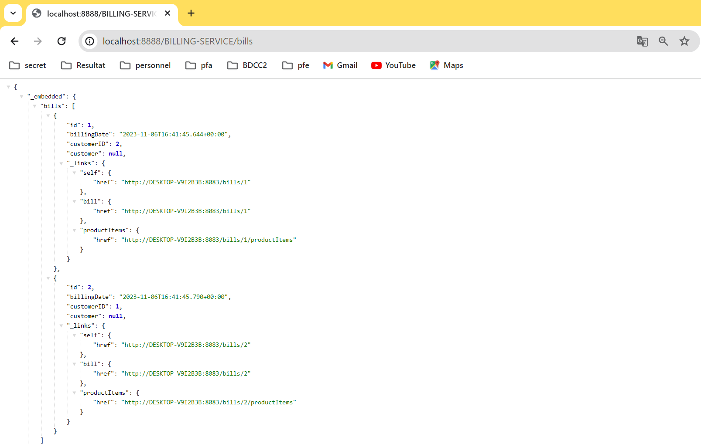

# Activité pratique N°2 : Architectures Micro-services avec Spring cloud
## Première partie : (Customer-Service, Inventory-Service, Spring Cloud Gateway, Eureka Discovery)
### Dependencies
Dans tous les microservices, nous avons utilisé les dépendances suivantes :
  - Lombok
  - DevTools
  - Spring Web
  - Spring Data JPA
  - h2 Database
  - Eureka Discovery
  - Spring Boot Actuator
### Premier microservice Customer-Service
Notre premier microservice concerne l'ajout des clients. Pour atteindre cet objectif, nous devons créer deux composants :
- Entités : Customer.java
- Repositories : CustomerRepository.java

Chaque microservice a un numéro de port et un nom, donc nous devons configurer le service dans le fichier ``application.properties``.

```properties
server.port=8081
spring.application.name=customer-server
spring.datasource.url=jdbc:h2:mem:customer-db
spring.cloud.discovery.enabled=true
```

Pour ajouter des clients dans la base de données, dans le fichier `CustomerServiceApplication.java`, nous ajoutons la fonction `start`.

```java
@Bean
	CommandLineRunner start(CustomerRepository customerRepository, RepositoryRestConfiguration restConfiguration){
		restConfiguration.exposeIdsFor(Customer.class);
		return  args -> {
			customerRepository.save(new Customer(null,"Sokaina","sokainadaabal@gmail.com"));
			customerRepository.save(new Customer(null,"Siham","siham@gmail.com"));
			customerRepository.save(new Customer(null,"Rachida","rachida@gmail.com"));
		};

	}
```

À travers ce lien `localhost:8081/customers`, vous pouvez tester le fonctionnement de notre micro-service :


### Deuxième microservice Inventory-Service

Notre deuxième microservice concerne l'ajout des produits. Pour réaliser cet objectif, nous devons créer deux composants dans le fichier `InventoryServiceApplication.java` :
- Entités : Product.java
- Repositories : ProductRepository.java

Chaque micro-service a un numéro de port et un nom, donc nous avons besoin de configurer le service dans le fichier `application.properties`.

```properties
server.port=8082
spring.application.name=inventory-service
spring.datasource.url=jdbc:h2:mem:inventory-db
spring.cloud.discovery.enabled=true
```

Pour ajouter des produits dans la base de données, dans le fichier `InventoryServiceApplication.java`, nous ajoutons la fonction `start`.

```java
@Bean
	CommandLineRunner start(ProductRepository productRepository, RepositoryRestConfiguration restConfiguration){
		restConfiguration.exposeIdsFor(Product.class);
		return args -> {
			productRepository.save(new Product(null,"Computer",12387D,23));
			productRepository.save(new Product(null,"Iphone",12387D,23));
			productRepository.save(new Product(null,"imprimante",12387D,23));
			productRepository.findAll().forEach(p->{
				System.out.println(p.getName() );
			});
		};

	}
```

Pour tester ces microservices, nous accédons à ce lien `localhost:8082/products`.


### Spring Cloud Gateway

Nous avons besoin d'une passerelle entre les deux microservices. Il faut ajouter les dépendances suivantes :
- Spring Cloud Gateway
- Eureka Discovery Client
- Spring Boot Actuator

La même configuration dans le fichier `application.properties`, nous avons ajouté le port et le nom d'application :

```properties
server.port=8888
spring.application.name=geteway-service
spring.cloud.discovery.enabled=true
```

Il y a deux façons de configurer le Spring Cloud Gateway. 

L'utilisation d'un fichier `.yml` est courante. 

Cependant, pour la passerelle, il ne faut pas utiliser `application.yml` mais plutôt changer son nom en app.yml

```yaml
spring:
  cloud:
    gateway:
      routes:
        - id: r1
          uri: http://localhost:8081
          predicates:
            - Path= /customers/**
        - id: r2
          uri: http://localhost:8082
          predicates:
            - Path= /products/**

```

Utilisation de configuration Java pour identifier leur ID :

```java

RouteLocator routeLocator(RouteLocatorBuilder routeLocatorBuilder){
		// on le fait lorsque connaitre les micro service
		return routeLocatorBuilder.routes()
				.route((r)->r.path("/customers/**").uri("lb://CUSTOMER-SERVER"))
				.route((r)->r.path("/products/**").uri("lb://INVENTORY-SERVICE"))
				.build();
}
```

Où peut-on rendre tout cela dynamique avec cette simple fonction

```java
@Bean
	// a chaque fois que tu recoit une requete regrade dans l'url tu va trouver le nom de micro service,il prend ce dernier et router la requete vers le bon micro-service.
DiscoveryClientRouteDefinitionLocator definitionLocator(ReactiveDiscoveryClient rdc, DiscoveryLocatorProperties properties){
		return new DiscoveryClientRouteDefinitionLocator(rdc,properties);
}
```

À ce stade, on peut accéder à customer-service et inventory-service via la gateway-service

    - localhost:8888/customers
    - localhost:8888/products


### Eureka Discovery

Eureka est un serveur d'enregistrement et de découverte de services couramment utilisé en conjonction avec Spring Boot pour la création de microservices. Il permet aux microservices de se trouver et de communiquer entre eux dans un environnement dynamique et évolutif.

Pour l'utiliser, nous avons ajouté au projet les dépendances suivantes :
- Eureka Discovery Server.

Dans le fichier `EurekaDiscoveryApplication.java`, nous avons ajouté l'annotation suivante : `@EnableEurekaServer`.

De la même manière, nous avons configuré le fichier `application.properties` :

```properties
server.port=8761

# dont register server itself as a client
eureka.client.fetch-registry=false

# does not register itself in the service registry
eureka.client.register-with-eureka=false
```

Pour accéder à l'interface d'Eureka :


Pour autoriser les microservices à se connecter à Eureka, il faut ajouter la configuration suivante dans `application.properties` : `spring.cloud.discovery.enabled=true`. 

Eureka affiche les IDs :


## Deuxième Partie : Billing Service avec Open Feign Rest Client

Pour réaliser cette partie, nous avons besoin d'exécuter les microservices dans l'ordre suivant :

- Eureka-discovery (Port : 8761)
- Customer-service (Port : 8081)
- Inventory-Service (Port:8082)
- Gateway (Port : 8888)
### Billing Service

Ce microservice a pour but de permettre aux clients de commander des produits. Pour cela, nous devons gérer les commandes de chaque client. 

Nous commençons par l'ajout des dépendances : 
  - Lombok 
  - DevTools
  - Spring Web
  - Spring Data JPA
  - h2 Database
  - Eureka  Discovery Client 
  - Spring Cloud OpenFeign 
  - Rest Repositories
  - Spring HATEOAS

Par la suite, nous avons créé les composants suivants :

  - Entities :
    - Bill.java
    - ProductItem.java
  - Repositories :
    - BillRepository.java
    - ProductItemRepository.java
  - Modules :
    - Customer.java
    - Product.java
  - Web :
    - BillingRestController.java
  - feign :
    - CustomerRestClient.java
    - ProductItemRestClient.java

Nous avons ajouté l'annotation `@EnableFeignClients` dans `BillingServiceApplication.java`.
Nous avons configuré le microservice à travers le fichier `application.properties`:

```properties
server.port=8083
spring.application.name=billing-service
spring.datasource.url=jdbc:h2:mem:billing-db
spring.cloud.discovery.enabled=true
```
Pour retourner les ID du consommateur (consumer) et du produit (product), nous avons ajouté dans la fonction start du service client (customer-service) :

```java
@Bean
	CommandLineRunner start(CustomerRepository customerRepository, RepositoryRestConfiguration restConfiguration){
		restConfiguration.exposeIdsFor(Customer.class);
        ...
```

La même chose a été faite dans le micro-service inventory-service :

```java
    @Bean
	CommandLineRunner start(ProductRepository productRepository, RepositoryRestConfiguration restConfiguration){
        restConfiguration.exposeIdsFor(Product.class);
        ...
```
Ensuite, on exécute le micro-service et on examine les résultats suivants : 



## Troisième Partie : Créer un Client Angular

Après avoir réalisé la partie backend, vient la partie front-end qui va être réalisée avec le framework Angular.

Nous avons créé un nouveau projet avec la commande suivante :

```shell
ng new bill-web-app
```

Et pour travailler avec Bootstrap, nous allons installer la dépendance suivante :

```shell
npm install boostrap 
```
Nous avons ajouté plusieurs composants :

- customers
- products
- orders
- order-details

Pour ajouter ces composants, nous avons besoin de cette commande :

```shell
ng generate component [component-name]
```
ou 
```shell
ng g c [component-name]
```

Pour lier les composants avec le micro-service nécessaire, nous avons utilisé ce code :

```ts
ngOnInit(): void {

    this.http.get("http://localhost:8888/CUSTOMER-SERVER/customers").subscribe({
    next:(data)=>{
      this.customers=data
    },error:(err)=>{}
    })
  }
```

La même logique s'applique à tous les composants.
Pour éviter le problème de CORS, nous sommes allés au service gateway, où nous avons créé un fichier `application.yml` en ajoutant les lignes suivantes :

```yaml
spring:
  cloud:
    gateway:
      globalcors:
        corsConfigurations:
          '[/**]':
           allowedOrigins: "http://localhost:4200"
           allowedHeaders: "*"
           allowedMethods:
              - GET
              - POST
              - PUT
              - DELETE
```
La partie suivante montre ma realisation dans la partie front-end en details.

## Test Partie Client (Angular)

https://github.com/sokainadaabal/Traitement-parallele-en-Big-Data/assets/48890714/547d00fe-82dd-4539-bb44-8e20614e9c2d

