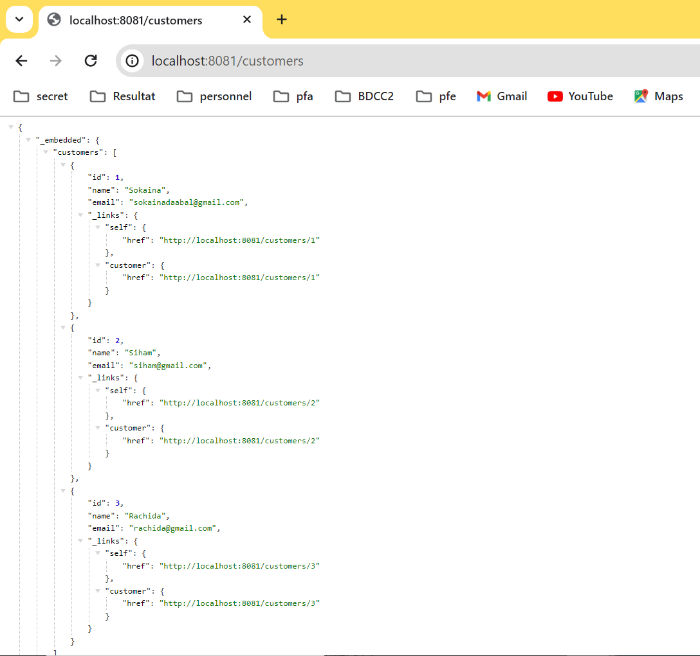
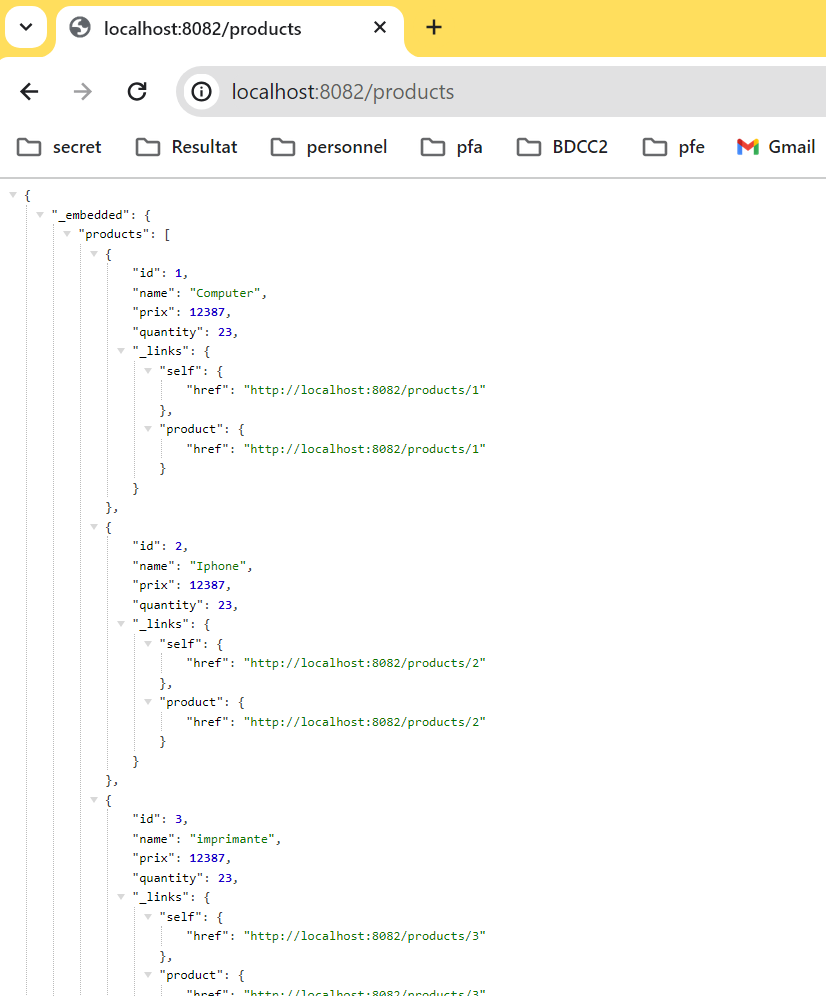
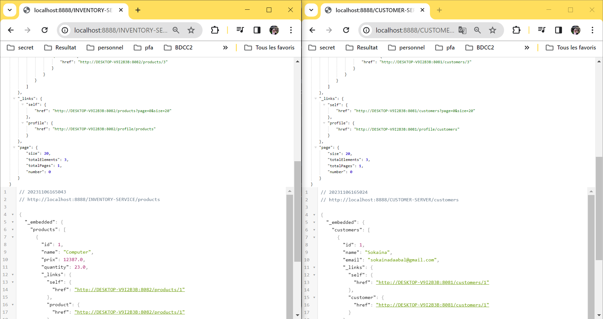
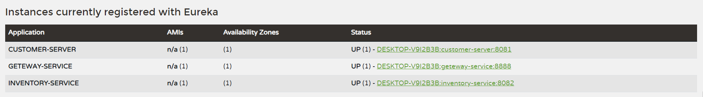

# Activité pratique N°2 : Architectures Micro-services avec Spring cloud
## Première partie : (Customer-Service, Inventory-Service, Spring Cloud Gateway, Eureka Discovery)
### Dependencies
Dans tous les micro-services, nous avons utilisé les dependencies suivantes :
  - Lombok
  - DevTools
  - Spring Web
  - Spring Data JPA
  - h2 Database
  - Eureka Discovery
  - Spring Boot Actuator
### Premier microservice Customer-Service
Notre premier microservice sera a l'ajout des clients, pour realiser ce but, nous avons besoin de creer deux composants :
  - Entities : Customer.java
  - Repositories : CustomerRepository.java
Chaque micro-service a une numero de port et un nom, donc on besoin de configurer le service dans le fichier ```application.properties.```:

```properties
server.port=8081
spring.application.name=customer-server
spring.datasource.url=jdbc:h2:mem:customer-db
spring.cloud.discovery.enabled=true
```

Pour ajouter des clients dans la base de donnes, dans le fichier ```CustomerServiceApplication.java```,on ajoute la fonction ```start```.
```java
@Bean
	CommandLineRunner start(CustomerRepository customerRepository, RepositoryRestConfiguration restConfiguration){
		restConfiguration.exposeIdsFor(Customer.class);
		return  args -> {
			customerRepository.save(new Customer(null,"Sokaina","sokainadaabal@gmail.com"));
			customerRepository.save(new Customer(null,"Siham","siham@gmail.com"));
			customerRepository.save(new Customer(null,"Rachida","rachida@gmail.com"));
		};

	}
```

a travers ce lien ```localhost:8081/customers``` on peut tester le fonctionnement de notre micro-service :



### Deuxième microservice Inventory-Service
Notre deuxième microservice sera a l'ajout des produits, pour realiser ce but, nous avons besoin de creer deux composants dans le fichier ```IneventoryServiceApplication.java``` :
- Entities : Product.java
- Repositories : ProductRepository.java
Chaque micro-service a une numero de port et un nom, donc on besoin de configurer le service dans le fichier ```application.properties.```:

```properties
server.port=8082
spring.application.name=inventory-service
spring.datasource.url=jdbc:h2:mem:inventory-db
spring.cloud.discovery.enabled=true
```

Pour ajouter des produits dans la base de donnes, dans le fichier ```InventoryServiceApplication.java```,on ajoute la fonction ```start```.
```java
@Bean
	CommandLineRunner start(ProductRepository productRepository, RepositoryRestConfiguration restConfiguration){
		restConfiguration.exposeIdsFor(Product.class);
		return args -> {
			productRepository.save(new Product(null,"Computer",12387D,23));
			productRepository.save(new Product(null,"Iphone",12387D,23));
			productRepository.save(new Product(null,"imprimante",12387D,23));
			productRepository.findAll().forEach(p->{
				System.out.println(p.getName() );
			});
		};

	}
```
Pour tester ces micro-services, nous accédons a ce lien ``localhost:8082/products`` 



### Spring Cloud Gateway
Nous avons besoin d'une gateway entre les deux micro-services, il faut ajouter les dependencies suivant :
  - Spring Cloud Gateway
  - Eureka Discovery Client
  - Spring Boot Actuator
La meme configuration dans le fichier ```application.properties```, nous avons ajouter le port et le nom d'application :
```properties
server.port=8888
spring.application.name=geteway-service
spring.cloud.discovery.enabled=true
```

Il ya deux facon pour configurer le spring cloud gateway.
Utilisation de fichier `.yml` , pour le gateway ne l'utilse pas appres en change leur non de `application.yml` a `app.yml`.
```yaml
spring:
  cloud:
    gateway:
      routes:
        - id: r1
          uri: http://localhost:8081
          predicates:
            - Path= /customers/**
        - id: r2
          uri: http://localhost:8082
          predicates:
            - Path= /products/**

```
Utilisation de configuration java, pour identifier leur ID :

```java

RouteLocator routeLocator(RouteLocatorBuilder routeLocatorBuilder){
		// on le fait lorsque connaitre les micro service
		return routeLocatorBuilder.routes()
				.route((r)->r.path("/customers/**").uri("lb://CUSTOMER-SERVER"))
				.route((r)->r.path("/products/**").uri("lb://INVENTORY-SERVICE"))
				.build();
}
```
ou peut rendre tous ca dynamique, avec cette simple fonction
```java
@Bean
	// a chaque fois que tu recoit une requete regrade dans l'url tu va trouver le nom de micro service,il prend ce dernier et router la requete vers le bon micro-service.
DiscoveryClientRouteDefinitionLocator definitionLocator(ReactiveDiscoveryClient rdc, DiscoveryLocatorProperties properties){
		return new DiscoveryClientRouteDefinitionLocator(rdc,properties);
}
```

a ce stade en peut accede a customer-service et inventory-service via la gateway-servie :

    - localhost:8888/customers
    - localhost:8888/products



### Eureka Discovery
Eureka est un serveur d'enregistrement et de découverte de services couramment utilisé en conjonction avec Spring Boot pour la création de microservices. Il permet aux microservices de se trouver et de communiquer entre eux dans un environnement dynamique et évolutif.
Pour l'utiliser, nous avons ajouté au projet la dependencies suivant :
- Eureka Discovery Server.

Dans le fichier ```EurekaDiscoveryApplication,java```, nous avons ajouter l'annotation suivante : @EnableEurekaServer
De meme logique, nous avons configuré le fichier ```application.properties``` :
```properties
server.port=8761

# dont register server itself as a client
eureka.client.fetch-registry=false

# does not register itself in the service registry
eureka.client.register-with-eureka=false
```
Pour acceder a l'interface d'eureka :


Pour autoriser les micro-services de se connecter a eureka, il faut ajouter la configuration ``spring.cloud.discovery.enabled=true`` suivante dans ```application.properties```, Eureka affiche les IDs :



## Deuxième Partie : Billing Service avec Open Feign Rest Client
Pour realiser cette partie, nous avons besoin d'exécuter les micro-services dans l'order suivant :
- Eureka-discovery (Port : 8761)
- Customer-service (Port : 8081)
- Inventory-Service (Port:8082)
- Gateway (Port : 8888)
### Billing Service
ce micro service a dans le but que les clients commande des produits, pour cela nous tenant de gerer les commande de chaque client.
En commence par l'ajout des dépendances : 
  - Lombok 
  - DevTools
  - Spring Web
  - Spring Data JPA
  - h2 Database
  - Eureka  Discovery Client 
  - Spring Cloud OpenFeign 
  - Rest Repositories
  - Spring HATEOAS
Par suite, nous avons creer les composantes suivant : 
  - Entities
  - Repositories
  - Module
  - Web 
## Troisième Partie : Créer un Client Angular

## Test Partie Client (Angular)

https://github.com/sokainadaabal/Traitement-parallele-en-Big-Data/assets/48890714/547d00fe-82dd-4539-bb44-8e20614e9c2d

