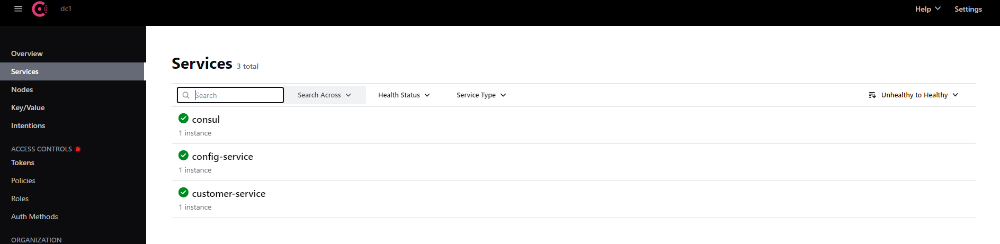
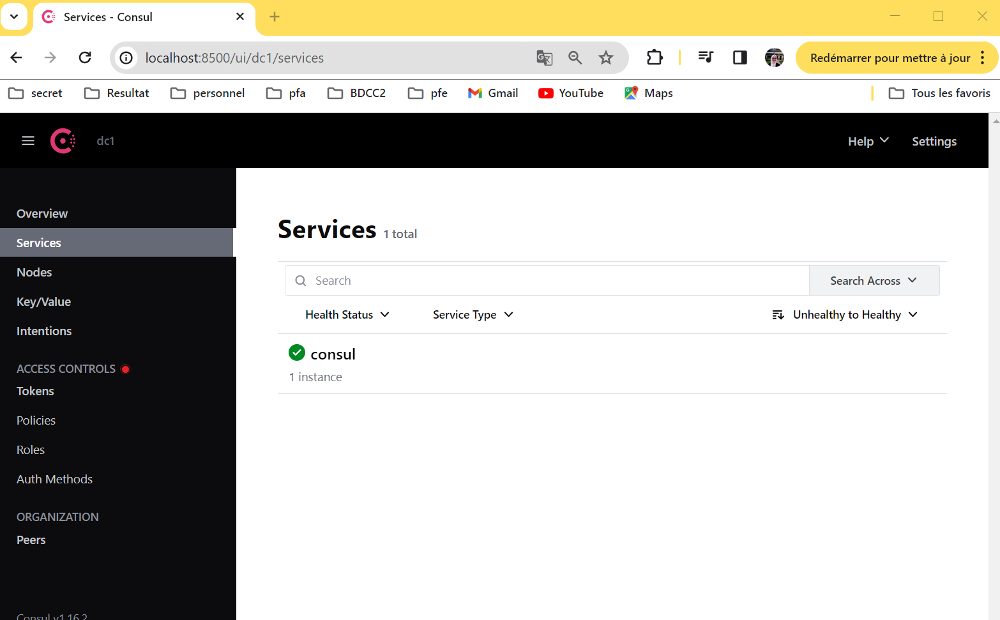

# Mise en oeuvre des architectures micro-services : Spring cloud Congig, Consul Discovery, Consul Config, Vault
## Configuration Service
### Dependence
- Spring Boot Actuator
- Consul Discovery
- Config Service

### Activer la configuration 

Pour activer la configuration, nous avons besoin de deux choses :
- annotation : @EnableConfigServer et @EnableDiscoveryClient dans la class main de config-service
- application.properties : 
```properties
server.port=8888
spring.application.name=config-service
```
Et nous avons besoin de creer un dossier `config-repo` dans lequel nous mettons la configuration de nos micro-services.
Ce dossier contient un fichier `application.properties`, ce fichier contient la configuration globale pour tous les micro-services.  
Dans le meme dossiers, nous avons la possiblite de creer des configurations adoptées pour un micro-service dans un environments soit de test, dev ou prod.


Dans chaque fichier en fait une configuration specifique.

On acces a config-repo en terminal puis en lance les commandes suivant :

```shell
git init
git add .
git commit -m "version1"
```
Revenir a le fichier `application.properties` dans le dossier `config-service` et ajouter l'url de dossier `config-repo`:
```properties
spring.cloud.config.server.git.uri=file:///C:/Users/Daabal Sokaina/Documents/GitHub/Traitement-parallele-en-Big-Data/Architectures-Micro-Services/config-repo
```

En demmare la config service :


Si en chois de consulter le service configuration en mode dev ou default :
- au mode default : va affichier les parametres de fichier `customer-service.properties` et `application.properties`


- au mode dev : va affichier les parametres de fichier `customer-service-dev.properties`,`customer-service.properties` et `application.properties`


Et meme pour toute la partie reste.

## Customer Service
### Dependence
- Spring web
- Spring Boot JPA
- H2 Database
- Lombok
- Rest Repositories 
- Spring Boot DevTools
- consul Discovery
- Config client : permet a le micro service de chercher leur configuration dans un service de configuration.
- Spring Boot Actuator
### configuration de micro-service: 
Pour que ce micro service eu la capacite de chercher leur configuration, nous avons beoisn d'ajouter une configuration dans le fichier `application.properties` pour voire au ce trouve config server :

```properties
server.port=8081
spring.application.name=customer-service

spring.config.import=optional:configserver:http://localhost:8888
```
Pour voir si le micro-service, a la capacite de voir leur configuration, nous avons ajouté un `RestController` dans le reprtoire `web` :

- CustomerConfigTestController 
```java
@RestController
public class CustomerConfigTestController {
    @Value("${global.param.p1}") // Pour injecter les variables de paramètre existant dans le fichier de configuration
    private  String p1;
    @Value("${global.param.p2}")
    private String p2;

    @Value("${customer.params.x}")
    private String X;

    @Value("${customer.params.y}")
    private String Y;

    /*
     function qui va returner les parameters à partir de fichier de configuration
     globale et le fichier de configuration par defaut de customer-service
     */

    @GetMapping("/params")
    public Map<String,String> params(){
        return Map.of("p1",p1,"p2",p2,"x",X,"y",Y);
    }
}
```

on demarre le micro service, le service sera afficher dans le consul 


En teste la fonction params et nous avons obtenus les resultats suivant :


Donc le micro-service cappable de consulter sa propore configuration et meme la configuration global.

Apres cette configuration, nous avons creer un RestController :
- entities : Customer
- repositories : CustomerRepository

Et dans la class main, nous avons inserer des enregistrements de customer :

```java
@Bean
	CommandLineRunner Start(CustomerRepository customerRepository){
		return args -> {
			customerRepository.saveAll(List.of(
					Customer.builder().name("sokaina").email("sokaina@gmail.com").build(),
					Customer.builder().name("rachida").email("rachida@gmail.com").build(),
					Customer.builder().name("siham").email("siham@gmail.com").build()
			));
			customerRepository.findAll().forEach(System.out::println);
		};
	}
```
En consulte le h2-consul, les enregistrements sont bien fait :


Id de customer, un element important pour la logique du micro-service, pour afficher nous utilison une projetction
```java
@Projection(name = "fullCustomer",types = Customer.class)
public interface CustomerProjection  {
    public Long getId();
    public String getName();
    public  String getEmail();

}
```
## Inventory Service
### Dependence
- Spring web
- Spring jpa
- H2 Database
- Lombok
- Rest Repositories
- Spring Boot DevTools
- consul Discovery
- Config client
- Spring Boot Actuator
### creation de inventory Service 
pour la creation de ce micro-service, nous suivons les etapes suivants: 
- Entities : creation de l'entite Product.
- Repositories : creation de repositories ProductRepository.
- Ajouter la fonction qui permet d'inserer les enregistrements des produits dans notre h2-database.
```java
@Bean
	CommandLineRunner start(ProductRepository productRepository){
		return args -> {
			Random random= new Random();
			for(int i=0;i<10;i++) {
				productRepository.saveAll(List.of(
								Product
										.builder()
										.name("PC"+i)
										.prix(1200+Math.random()*1000)
										.quantity(1+random.nextInt(200))
										.build()
						)
				);
			}

		};
	}
```
- Dans le fichier ```application.properties```, nous configurons notre micro-service :
```properties
server.port=8082
spring.application.name=inventory-service

spring.config.import=optional:configserver:http://localhost:8888
```

- et dans le reposotories `config-repo` existe `inventory-service.properties` contient la configuration totale de notre micro-service : 
```properties
management.endpoints.web.exposure.include=*
spring.datasource.url=jdbc:h2:mem:product-db
spring.h2.console.enabled=true
```
Une fois, nous lançons notre micro-service, il s'enregistre dans consule :

Pour tester le bon fuctionement de ce micro-service, nous tapons ce url http://localhost:9999/inventory-service/products:

Id de produit, un element important pour la logique du micro-service, pour afficher nous utilison une projection 
```java
@Projection(name = "fullProduct",types = Product.class)
public interface ProductProjection  {
    public Long getId();
    public String getName();
    public  double getPrice();
    public int getQuantity();

}
```
## order Service
### Dependence
- Spring web
- Spring jpa
- H2 Database
- Lombok
- Rest Repositories
- Spring Boot DevTools
- consul Discovery
- Config client
- Spring Boot Actuator
## Gateway Service
### Dependence 
- Consul Discovery
- Spring Boot Actuator
- Gateway
### Detecter les routes 
dans la class main, nous avons ajouter la function `definitionLocator` qui va detecter quel micro service doit repondre a requeret de client:
```java
  @Bean
// À chaque fois que tu reçois une request regrade dans l'URL, tu vas trouver le nom de micro service, il prend ce dernier et router la request vers le bon micro-service.
    DiscoveryClientRouteDefinitionLocator definitionLocator(ReactiveDiscoveryClient rdc, DiscoveryLocatorProperties properties){
            return new DiscoveryClientRouteDefinitionLocator(rdc,properties);
            }
```
Pour continu la configuration, nous avons ajouter quelques elements dans le fichier ```applications.properties```:
```properties
server.port=9999
spring.application.name=geteway-service

spring.config.import=optional:configserver:http://localhost:8888
```

Une fois la class main lance, la gateway enregistre dans consul :


Et atravers la gateway,nous avons abtenu les params de customer-service :


## Consul 
Allons sur le site https://developer.hashicorp.com/consul/install?product_intent=consul, nous téléchargeons le référentiel. Nous Décompressons-le et plaçons-le à l'endroit souhaité.
Ouvrir le terminal avec le mode administrateur, tapons la commande `ipconfig` pour voir l'adresse ip de notre machine.
et pour demarer le consul, nous tapons la commande suivante : 
```shell
consul agent -server -bootstrap-expect=1 -data-dir=consul-data -ui -bind=192.168.1.3
```
on peut aussi le demarer comme un conteneur docker.


Pour acceder a l'interface graphique de consul : http://localhost:8500/ui/dc1/services




## Vault 

```shell
vault server -dev
```
```shell
set VAULT_ADDR=http://127.0.0.1:8200
```

ajouter un key-value au vault 

```shell
vault kv put secret/billing-service user.username=sokaina  user.password=123456
```

retenir le detail met dans un dossier dans vault

```shell
vault kv get secret/billing-service
```

pour chercher les configrations depuis un micro-services vers vault, il faut ajouter des configurations dans le fichier `application.properties`:
```properties
spring.cloud.vault.token= hvs.Zy6uyQ6Ozs8PYxSUoVxu49N4
spring.cloud.vault.scheme=http
spring.cloud.vault.kv.enabled=true


spring.config.import=optional:consul:,vault://
```