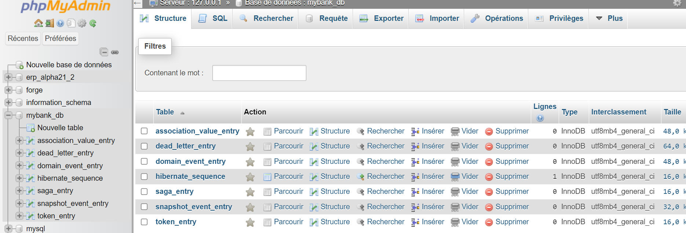
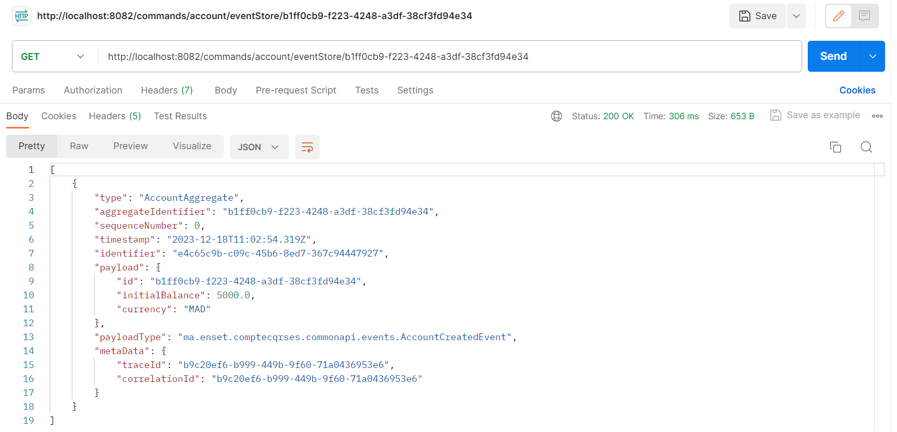

# Activité Pratique N°3 - Event Driven Architecture with Axiom and Spring Boot

## Partie 1: Event Driven Micro Services Architecture with CQRS and Event Sourcing - Use case With Axon

### Objectif:
Créer une application qui permet de gérer des comptes bancaires.
Cette application va permettre de :
* Ajouter un compte
* Activer un compte apres creation
* Créditer un compte 
* Débiter un compte 
* Consulter un compte
* Consulter les comptes
* Consulter les operations d'un comptes
* Suivre en temps reel l'état d'un compte 

### Architecture 

### Structure de projet 

### Dependencies 
  * Spring Data JPA
  * Spring Web
  * Mysql Driver
  * AXON Framework
  * Lombok
  * Open API
  * MapStruct
  * Spring Web Flux
  * plugin java Compiler mapStruct Processor Configuration
  Ajouter AXON Framework :
  ```xml
  <dependency>
      <groupId>org.axonframework</groupId>
      <artifactId>axon-spring-boot-starter</artifactId>
      <version>4.4.3</version>
      <exclusions>
          <exclusion>
          <groupId>org.axonframework</groupId>
          <artifactId>axon-server-connector</artifactId>
          </exclusion>
      </exclusions>
  </dependency>
  ```
### CommonApi

#### Command
Dans Le repertoire ```commonapi/command```, nous avons créé une classe `BaseCommand` de type générique.
* ```BaseCommand```
  ```java
  public abstract  class BaseCommand<T>{
      @TargetAggregateIdentifier // c'est identifier de aggregate dans la quel on va effectuer la commande
      @Getter    // des objets immuable -> usage seulement de getter
      private T id;
  
      public BaseCommand(T id){
          this.id=id;
      }
  }
  ```
Dans le meme repertoire, on va créer `CreateAccountCommand`.
* ```CreateAccountCommand```
  ```java
  public class CreateAccountCommand extends BaseCommand<String> {
      private double initialBalance;
      private String currency;
      public CreateAccountCommand(String id, double initialBalance, String currency) {
          super(id);
          this.initialBalance = initialBalance;
          this.currency = currency;
      }
  }
  ```
Et nous avons aussi la classe ```DebitAccountCommand``` et ```CreditAccountCommand``` qui extend abstract class ```BaseComand``` et ils ont deux variables ```amount``` et ```currency```.

#### Commandes

Dans le package ```commandes```, nous avons créé package ```controlles``` dans lequel nous avons mis les controllers lie à la commande.

Les dtos seront ajouter dans le package ```commandes```. Nous avons cree `CreateAccountRequestDTO`, ce dernier contient les attributes suivant :
* ```CreateAccountRequestDTO```
  ```java
  @Data
  @AllArgsConstructor
  @NoArgsConstructor
  public class CreateAccountRequestDTO {
     private double initialBalance;
     private String currency;
  }
  ```
Nous commençons par la creation de controller ```AccountCommandController```.
* ```AccountCommandController```
  ```java
  @RestController
  @RequestMapping(path = "/commands/account")
  
  public class AccountCommandController {
  
    private  CommandGateway commandGateway;
  
      public AccountCommandController(CommandGateway commandGateway) {
          this.commandGateway = commandGateway;
      }
  }
  ```
* ```createAccount``` : qui permet d'ajouter des comptes.
  ```java
  @PostMapping(path = "/creat")
      public CompletableFuture<String> createAccount(@RequestBody CreateAccountRequestDTO request){
        CompletableFuture<String> commandResponse;
          commandResponse = commandGateway.send(new CreateAccountCommand(
                  UUID.randomUUID().toString(),
                  request.getInitialBalance(),
                  request.getCurrency()
          ));
          return commandResponse;
      }
  ```
* ```eventStore``` va retourner le contenu de d'un aggregate.
  ```java
      public EventStore eventStore;
      @GetMapping("/eventStore/{accountId}")
      public Stream eventStore(@PathVariable String accountId) {
          return eventStore.readEvents(accountId).asStream();
      }
  ```
* ```creditAccount```: modifier le montant d'un compte.
  ```java
      @PutMapping(path = "/credit")
      public CompletableFuture<String> creditAccount(@RequestBody CreditAccountRequestDTO request) {
          return commandGateway.send(new CreditAccountCommand(
                  request.getAccountId(),
                  request.getAmount(),
                  request.getCurrency()
          ));
      }
  ```
#### Event
Dans le package ```packages/events```, nous avons cree meme logique que dans le package `commands` mais avec quelque modifications (les objets simples pas des annotations).
Ce package contient les classes suivantes : 
  * BaseEvent
  * AccountCreatedEvent
  * AccountActivatedEvent
  * AccountCreditedEvent
### Configuration 
Dans le fichier ``application.propoerties``, nous avons ajouté la configuration de notre application.
```properties
spring.application.name=compte-service
spring.datasource.url=jdbc:mysql://localhost:3306/mybank_db?createDatabaseIfNotExist=true
spring.datasource.username=root
spring.datasource.password=
spring.jpa.hibernate.ddl-auto=update
spring.jpa.properties.hibernate.dialect=org.hibernate.dialect.MariaDBDialect
server.port=8082
```

### DataBase 

Lorsqu'en lance notre projet, la base de donnee se crée automatiquement et contient les tables suivantes :


Dans la table ```domain_event_entry```, nous avons trouvé nos enregistrements.
### Test 

On exécute notre premier test en utilisant Postman.
* URL :`localhost:8082/commands/account/create`
* Body: ajouter `content-type : application-json`
* Request :
  ```json
    {
    "initialBalance":9000,
    "currency":"MAD"
    }
  ```
* Response : va retourner id de compte.
#### EventStore
* URL : ```http://localhost:8082/commands/account/eventStore/b1ff0cb9-f223-4248-a3df-38cf3fd94e34```


### Aggregate

C'est dans laquelle on va execute la logique metier.
Dans notre package commands, nous avons créé un sous package accountAggregate.
Dans ce package nous avons créé la classe ```AccountAggregate```.

```java
@Aggregate
public class AccountAggregate {

    @AggregateIdentifier // id is  presented targetAggregateIdentifier
    private String accountId;
    private double balance;
    private String currency;

    private AccountStatus status;
}
```
Elle va nous permettre de définir l'état de count a l'aide l'enum ```AccountStatus```.

Obligatoire d'avoir un constructeur sans parameter.
Apres, nous ajoutons dans cette class un handler qui va execute ou moment de la creation de compte.
Et pour le faire, nous avons besoin de la creation d'un event class.

#### La fonction de decision

```java
    @CommandHandler // subscribe sur le bus de commande
    public AccountAggregate(CreateAccountCommand command) {
        if(command.getInitialBalance()<0){
            throw new RuntimeException("Impossible ....");
        }
        // ON
        AggregateLifecycle.apply(new AccountCreatedEvent(
                command.getId(),
                command.getInitialBalance(),
                command.getCurrency()
        ));
        // Axon va charger de l'ajouter dans la base de donnees.
    }
```

#### Changement l'état de compte

Lorsque un Account va créer, la fonction ```On``` charger de changer état account.

```java
    @EventSourcingHandler
    public void on(AccountCreatedEvent event){
        this.accountId= event.getId(); // nous avons pas le besoin, id est attribué au moment de la creation de compte.
        this.balance=event.getInitialBalance();
        this.currency=event.getCurrency();
        this.status=AccountStatus.CREATED;
    }
```


