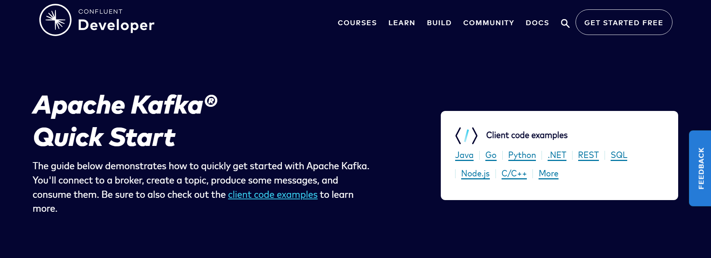
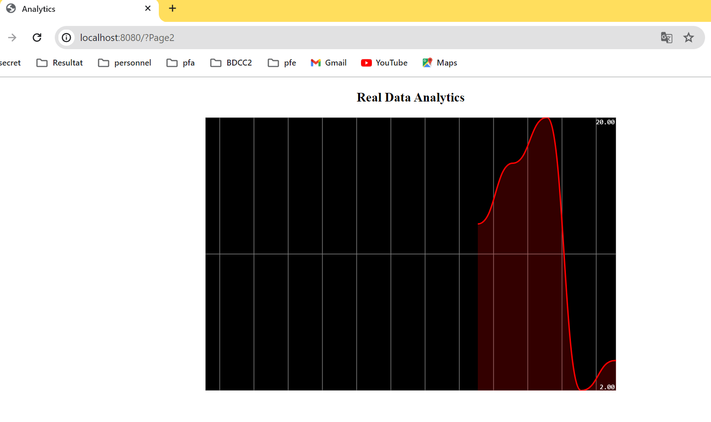

# Activité pratique N° 1 : Event Driven Architecture
## Partie 1 : Kafka 
La première partie de notre activité pratique portait sur la compréhension de Kafka, une plateforme de streaming distribuée, ainsi que sur les étapes d'installation de Kafka sur un système Windows. 
En mettant en évidence la configuration des fichiers et le lancement des services nécessaires.
### Kafka : Qu'est-ce que c'est ?
Kafka est une plateforme de streaming distribuée largement utilisée dans les systèmes Unix, bien qu'elle soit également compatible avec Windows. 
Il est conçu pour gérer efficacement le traitement des données en temps réel à grande échelle. 
Cette technologie est essentielle pour les architectures orientées événements, car elle permet de collecter, stocker et distribuer des flux de données en temps réel de manière fiable.
### Installation de Kafka sur Windows et son lancement
Pour commencer à utiliser Kafka sur Windows, nous avons suivi les étapes d'installation suivantes :

1. Vérification de la présence de Java : La première étape consiste à vérifier si Java est déjà installé sur notre système, car Kafka dépend de Java pour fonctionner. Si Java n'est pas déjà installé, il est possible de télécharger la dernière version de Java JDK à partir du site officiel d'Oracle (https://www.oracle.com/java/technologies/javase-downloads.html). 
2. Configuration de la variable d'environnement JAVA_HOME : Une fois Java installé, il est impératif de s'assurer que la variable d'environnement JAVA_HOME est correctement configurée. Pour vérifier cela, nous avons exécuté la commande suivante dans une invite de commande :
   ```shell
      echo %JAVA_HOME%
   ```
   Il est essentiel que cette commande renvoie le chemin vers le répertoire d'installation de Java. Si ce n'est pas le cas, nous avons pris les mesures nécessaires pour configurer correctement la variable d'environnement.
3. Téléchargement de Kafka : Pour poursuivre, nous avons téléchargé Kafka depuis le site officiel de Kafka (https://kafka.apache.org/downloads). Nous avons choisi la dernière version de Kafka destinée à Windows. Après avoir téléchargé l'archive, nous avons procédé à sa décompression dans un répertoire de notre choix. Pour notre démonstration, nous avons opté pour le répertoire C:\kafka.
4. Ouverture d'une invite de commande en mode administrateur : Avant de lancer les services Kafka, il est essentiel d'ouvrir une invite de commande (cmd) en mode administrateur. Nous assurons que l'autorisation nécessaire est accordée pour effectuer ces opérations.
5. Navigation dans le répertoire Kafka : Nous avons navigué vers le répertoire où nous avions extrait Kafka, ce qui peut être réalisé avec la commande suivante :
   ```shell
     cd C:\kafka
   ```
6. Lancement du serveur ZooKeeper : ZooKeeper est un composant essentiel pour le fonctionnement de Kafka. Nous avons lancé le serveur ZooKeeper en exécutant la commande suivante :
   ```shell
     bin\windows\zookeeper-server-start.bat config\zookeeper.properties
   ```


8. Démarrage du serveur Kafka : Enfin, nous avons ouvert une autre fenêtre de l'invite de commande pour lancer le serveur Kafka en exécutant la commande suivante :
   ```shell
      bin\windows\kafka-server-start.bat config\server.properties
   ```
   


### Test de Kafka avec Kafka-console-producer et kafka-console-consumer
Nous avons exploré comment tester Kafka en utilisant les outils kafka-console-producer et kafka-console-consumer. Ces outils nous permettent d'envoyer et de recevoir des messages depuis un topic Kafka.
Pour cela, nous avons suivi ces étapes :
1. Vérification du bon fonctionnement de Kafka et ZooKeeper : Avant de commencer le test, nous nous sommes assurés que notre serveur Kafka et ZooKeeper étaient en cours d'exécution. Nous avons d'abord exécuté ZooKeeper, suivi de Kafka, comme décrit précédemment.
2. Ouverture de deux invites de commande distinctes : Pour effectuer le test, nous avons ouvert deux invites de commande, l'une pour le producteur et l'autre pour le consommateur.
3. Exécution du producteur Kafka : Dans la première fenêtre de l'invite de commande, nous avons utilisé la commande kafka-console-producer pour exécuter le producteur Kafka. Nous nous sommes assurés de spécifier le serveur et le topic auquel nous souhaitions envoyer des messages. Par exemple, pour envoyer des messages à un topic nommé "test-topic", nous avons utilisé la commande suivante :
   ```shell
   bin\windows\kafka-console-producer.bat --broker-list localhost:9092 --topic test-topic
   ```
   Cette commande a ouvert un shell interactif où nous pouvions saisir des messages à envoyer au topic.
4. Exécution du consommateur Kafka : Dans la deuxième fenêtre de l'invite de commande, nous avons exécuté le consommateur Kafka en utilisant la commande kafka-console-consumer. Nous avons également spécifié le serveur et le topic que nous souhaitions consommer. Par exemple, pour consommer des messages du "test-topic" depuis le début, nous avons utilisé la commande suivante :
   ```shell
   bin\windows\kafka-console-consumer.bat --bootstrap-server localhost:9092 --topic test-topic --from-beginning
   ```
   L'option --from-beginning indiquait que nous souhaitions consommer tous les messages depuis le début du topic. Nous avons ainsi pu voir les messages que nous avons envoyés depuis le producteur.
5. Envoi de messages depuis le producteur : Dans la fenêtre du producteur, nous avons commencé à saisir des messages et avons appuyé sur Entrée pour les envoyer. Ces messages ont été envoyés au topic spécifié.
6. Réception des messages dans le consommateur : Dans la fenêtre du consommateur, les messages que nous avons envoyés depuis le producteur sont apparus au fur et à mesure qu'ils étaient consommés. Cela a démontré avec succès le fonctionnement de Kafka pour la transmission de messages en temps réel.


## Partie 2 : Docker
Dans cette partie de notre activité pratique, nous avons exploré le processus d'installation de Docker sur un système Windows. 
Docker est une technologie de conteneurisation qui permet de créer, gérer et exécuter des conteneurs légers pour l'isolation d'applications.
### Installation de docker dans Windows
1. Accès au site de Docker : Pour commencer, nous avons visité le site officiel de Docker à l'adresse suivante : https://docs.docker.com/desktop/install/windows-install/. C'est sur ce site que nous avons téléchargé la version Desktop de Docker, adaptée à Windows.
2. Téléchargement et installation : Après avoir téléchargé le programme d'installation de Docker Desktop, nous avons ouvert PowerShell et nous nous sommes déplacés vers le répertoire où se trouvait le fichier. Ensuite, nous avons lancé la commande suivante pour exécuter l'installation :
   ``` shell
      Start-Process 'Docker Desktop Installer.exe' -Wait
   ```
   Cette commande a lancé le processus d'installation de Docker Desktop sur notre système.
3. Pré-requis : Installation de WSL (Windows Subsystem for Linux) : Avant de démarrer Docker, il est important de s'assurer que Windows Subsystem for Linux (WSL) est correctement installé sur votre système. WSL permet d'exécuter des applications Linux sur Windows, ce qui est essentiel pour le fonctionnement de Docker.
4. Démarrage de Docker Desktop : Après avoir effectué l'installation et vérifié que WSL est en place, nous avons démarré Docker Desktop. Cette étape a été effectuée en lançant l'application Docker Desktop depuis le menu Windows.
5. Docker Desktop est un outil puissant qui permet de créer et de gérer des conteneurs Docker sur un système Windows, ce qui est essentiel pour l'orchestration d'applications basées sur des conteneurs.
### building a Java client application for Kafka
Dans cette partie de notre activité pratique, nous avons suivi le guide disponible à l'adresse https://developer.confluent.io/quickstart/kafka-local/ pour créer une application cliente Java pour Kafka. 



Les étapes comprenaient la création d'un projet avec Gradle, l'utilisation de Java 18, la mise en place d'un fichier docker-compose.yml, le déploiement de conteneurs Docker, et enfin, la création d'un producteur et d'un consommateur pour interagir avec Kafka.
   - fichier ``docker-compose.yml`` :
      ```yaml
      version: '3'
      services:
         broker:
            image: confluentinc/cp-kafka:7.5.0
            container_name: broker
            ports:
              - "9092:9092"
         environment:
            KAFKA_BROKER_ID: 1
            KAFKA_LISTENER_SECURITY_PROTOCOL_MAP: CONTROLLER:PLAINTEXT,PLAINTEXT:PLAINTEXT,PLAINTEXT_HOST:PLAINTEXT
            KAFKA_ADVERTISED_LISTENERS: PLAINTEXT://broker:29092,PLAINTEXT_HOST://localhost:9092
            KAFKA_OFFSETS_TOPIC_REPLICATION_FACTOR: 1
            KAFKA_GROUP_INITIAL_REBALANCE_DELAY_MS: 0
            KAFKA_TRANSACTION_STATE_LOG_MIN_ISR: 1
            KAFKA_TRANSACTION_STATE_LOG_REPLICATION_FACTOR: 1
            KAFKA_PROCESS_ROLES: broker,controller
            KAFKA_NODE_ID: 1
            KAFKA_CONTROLLER_QUORUM_VOTERS: 1@broker:29093
            KAFKA_LISTENERS: PLAINTEXT://broker:29092,CONTROLLER://broker:29093,PLAINTEXT_HOST://0.0.0.0:9092
            KAFKA_INTER_BROKER_LISTENER_NAME: PLAINTEXT
            KAFKA_CONTROLLER_LISTENER_NAMES: CONTROLLER
            KAFKA_LOG_DIRS: /tmp/kraft-combined-logs
            CLUSTER_ID: MkU3OEVBNTcwNTJENDM2Qk
      ```
   - Compiler et démarrer l'environnement :


     
   - Container crée :


   - Broker :


   - create a file configuration et ensuivre le reste des étapes 
   - Démarrer les conteneurs docker : zookeeper et kafka-broker
   - creation de topic 
     ```shell
        docker compose exec broker \
        kafka-topics --create \
        --topic purchases \
        --bootstrap-server localhost:9092 \
        --replication-factor 1 \
        --partitions 1
     ```
     


   - Creation de producer et customer class
   - Tester avec Kafka-console-producer et kafka-console-consumer
     - Build
      ```shell
        gradle build
      ```
      
      
     
     - creation de repertoir jar 
      ```shell
        gradle shadowJar
      ```

     
     
     - Produce et consume 
      ```shell
       java -cp build/libs/kafka-java-getting-started-0.0.1.jar org.example.ProducerExample getting-started.properties
       java -cp build/libs/kafka-java-getting-started-0.0.1.jar org.example.ConsumerExample getting-started.properties
      ```


### Test Communication 
pour tester la communication, nous tapons les commandes suivantes : 
```shell
docker exec --interactive --tty broker kafka-console-consumer --bootstrap-server broker:9092 --topic topic_test
docker exec --interactive --tty broker kafka-console-producer --bootstrap-server broker:9092 --topic topic_test
docker exec --interactive --tty broker kafka-console-consumer --bootstrap-server broker:9092 --topic topic_test2 --property print.key=true --property print.value=true --property key.deserializer=org.apache.kafka.common.serialization.StringDeserializer --property value.deserializer=org.apache.kafka.common.serialization.LongDeserializer
docker exec --interactive --tty broker kafka-topics --bootstrap-server broker:9092 --list
```


## Partie 3 : KAFKA et Spring Cloud Streams
La première partie consiste à créer un Service Producer KAFKA via un Rest Controller, la deuxième partie est un Service Consumer KAFKA, la troisième partie est un Service Supplier KAFKA. La quatrième partie concerne un Service de Data Analytics Real-Time Stream Processing avec Kafka Streams, et enfin, la cinquième partie concerne une application Web qui permet d'afficher les résultats du Stream Data Analytics en temps réel.
### 3.1 Un Service Producer KAFKA Via RestController
#### 3.1.1 Dependence
Notre projet besoin les dependances suivantes :
- Spring Web.
- Lombok.
- Spring for Apache kafka.
- Spring for Apache kafka Streams.
- Cloud Stream


#### 3.1.2 Creation de PageEvent et PageEventRestController
- ```PageEvent``` : une classe qui représente les événements d'une page (nom, utilisateur, date, durée)..
- ```PageEventRestController``` : représente un contrôleur REST pour les événements d'une page.

#### 3.1.3 Test 
Pour tester le fonctionnement du service producteur, vous devez démarrer Zookeeper et Kafka.


Vous pouvez lancer l'URL suivante : http://localhost:8080/publish/test-topic/sokaina. Cela correspond au nom du topic ```test-topic``` et au nom de l'utilisateur ```sokaina```.


### 3.2 Un Service Consumer KAFKA
Pour créer un service consommateur, nous avons créé la classe ```PageEventService```. Cette classe contient la fonction suivante :
- ```pageEventCustomer``` : une fonction qui affiche les événements de page produits.
Pour configurer le fichier application.properties et ajouter le topic qui recevra les événements de pages produits, vous pouvez ajouter la ligne suivante
```properties
spring.cloud.stream.bindings.pageEventCustomer-in-0.destination=test-topic
```
De plus, il est nécessaire que la fonction soit déclarée dans le fichier de propriétés :
```properties
# declaration de fonction
spring.cloud.function.definition=pageEventCustomer
```
Pour le test, nous relançons le projet et envoyons un événement de page via le Rest controller. Cet événement doit être consommé par le consommateur et afficher un message dans le terminal :


### 3.3 Un Service Supplier KAFKA
La première chose à faire est la création du topic R2. Ensuite, ajoutons dans la classe PageEventService.java une fonction ```pageEventSupplier``` qui retournera un Supplier<PageEvent>. Cela permettra de créer des événements de pages toute seconde et de les envoyer à un topic.
Pour cela, nous avons besoin d'ajouter la configuration suivante dans le fichier properties :
```properties
spring.cloud.stream.bindings.pageEventSupplier-out-0.destination=R2
# declaration de fonction
spring.cloud.function.definition=pageEventSupplier;pageEventCustomer
# par defaut 1000, la frequence de generation devenu plus rapide
spring.cloud.stream.poller.fixed-delay=100
```
On lance le projet et on vérifie si le topic R2 reçoit les événements.


#### 3.3.1 Modification des événements produit par pageEventSupplier

Dans la classe `PageEventService`, la fonction suivante sera `Function<PageEvent, PageEvent> pageEventPageFunction()`. Cette fonction consommera les événements de pages produits par la fonction `pageEventSupplier`, modifiera le nom de la page et le nom de l'utilisateur, puis les enverra vers le topic 4.
Pour configurer cela dans le fichier de propriétés, nous pouvons ajouter les configurations suivantes :

```properties
# bindings de la function pageEventPageFunction
spring.cloud.stream.bindings.pageEventPageFunction-in-0.destination=R2
spring.cloud.stream.bindings.pageEventPageFunction-out-0.destination=R3
```
Ensuite, nous allons lancer le topic R3 :

```shell
start bin\windows\kafka-console-consumer.bat --bootstrap-server localhost:9092 --topic R3 --from-beginning
```
Nous obtenons le résultat suivant :


### 3.4 un Service de Data Analytics Real-Time Stream Processing avec Kafka Streams
Dans la classe PageEventService, nous avons ajouté la fonction suivante : `Function<KStream<String, PageEvent>, KStream<String, Long>> kStreamFunction()`. Cette fonction recevra les événements de page produits à partir du topic R2, calculera le nombre de pages consultées par chaque utilisateur, et les enverra vers le topic R4.

Pour configurer cela dans le fichier properties, nous pouvons ajouter les configurations suivantes :
```properties
# bindings de la function kStreamFunction
spring.cloud.stream.bindings.kStreamFunction-in-0.destination=R2
spring.cloud.stream.bindings.kStreamFunction-out-0.destination=R4
```
Nous lançons le topic R4 :
```shell
start bin\windows\kafka-console-consumer.bat --bootstrap-server localhost:9092 --topic R4 --property print.key=true --property print.value=true --property key.deserializer=org.apache.kafka.common.serialization.StringDeserializer --property value.deserializer=org.apache.kafka.common.serialization.LongDeserializer
```

Nous avons obtenu les résultats suivants :


Dans la classe `PageEventRestController`, nous avons ajouté deux fonctions avec des signatures différentes. L'une calculera le nombre de visites d'une page spécifique, et l'autre calculera le nombre de visites pour toutes les pages.

```spel
    @GetMapping(path="/analytics/{page}" ,produces = MediaType.TEXT_EVENT_STREAM_VALUE)
    public Flux<Map<String,Long>> analytics(@PathVariable String page){
        return Flux.interval(Duration.ofSeconds(1))
                .map(seqence->{
                    Map<String,Long> stringLongMap = new HashMap<>();
                    ReadOnlyWindowStore<String,Long> stats= interactiveQueryService.getQueryableStore("page-count", QueryableStoreTypes.windowStore());
                    Instant now= Instant.now();
                    Instant from= now.minusMillis(5000);
                    // personnaliser la data pour qu'il affiche sauf les donnes du seul page
                    WindowStoreIterator<Long> fetchAll2= stats.fetch(page,from,now);
                    while (fetchAll2.hasNext()){
                            KeyValue<Long,Long> next = fetchAll2.next();
                            stringLongMap.put(page,next.value);
                        }
                    return stringLongMap;
                }).share();
        //share permet que la meme resultat pour tous les utilisateurs connecte
    }
    
````

            
```spel
    
    @GetMapping(path="/analytics" ,produces = MediaType.TEXT_EVENT_STREAM_VALUE)
    public Flux<Map<String,Long>> analytics(){
        return Flux.interval(Duration.ofSeconds(1))
                .map(seqence->{
                    Map<String,Long> stringLongMap = new HashMap<>();
                    ReadOnlyWindowStore<String,Long> stats= interactiveQueryService.getQueryableStore("page-count", QueryableStoreTypes.windowStore());

                    Instant now= Instant.now();
                    Instant from= now.minusMillis(5000);
                    KeyValueIterator<Windowed<String>,Long> fetchAll= stats.fetchAll(from,now);
                    while (fetchAll.hasNext()){
                            KeyValue<Windowed<String>,Long> next = fetchAll.next();
                            stringLongMap.put(next.key.key(),next.value);
                    }
                    return stringLongMap;
                }).share();
        //share permet que la meme resultat pour tous les utilisateurs connecte
    }
```
Nous allons lancer l'URL suivante http://localhost:8080/analytics et obtenir les résultats suivants :


Si l'on lance l'URL suivante http://localhost:8080/analytics/Page1, nous obtiendrons les résultats spécifiques à la page 1.


### 3.5 Une application Web qui permet d'afficher les résultats du Stream Data Analytics en temps réel

Nous allons créer une page HTML dans le répertoire "static" dans laquelle nous afficherons les résultats de l'analyse de flux de données en temps réel en utilisant le framework Smoothie Chart. 
Dans le fichier `index.html`, il faut préciser où se trouve le flux de données :

```javascript
        var stockEventSource = new EventSource("/analytics");
        stockEventSource.addEventListener("message",function (event){
            pages.forEach(function (V){
                val=JSON.parse(event.data)[V];
                courbe[V].append(new Date().getTime(),val);
            })
        });
```
Cela permet d'afficher les données analytiques d'une page précise :
```javascript
    var stockEventSource2 = new EventSource("/analytics/"+page);
    stockEventSource2.addEventListener("message",function (event){
        pages.forEach(function (V){
            val=JSON.parse(event.data)[V];
            courbe[V].append(new Date().getTime(),val);
        })
    });
```
Pour tester, nous utilisons l'URL suivante : http://localhost:8080/?


Pour obtenir les résultats du page1, nous utilisons l'URL suivante : http://localhost:8080/?Page1


Pour obtenir les résultats du page2, nous utilisons l'URL suivante : http://localhost:8080/?Page2


