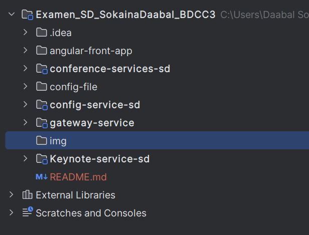
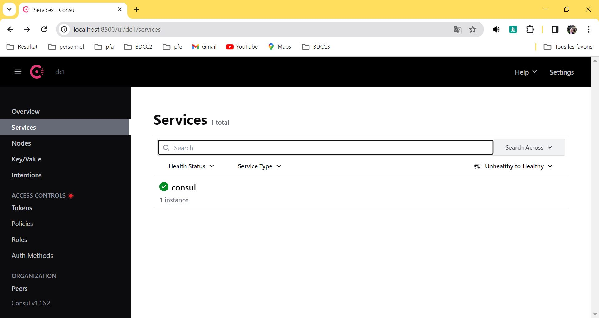
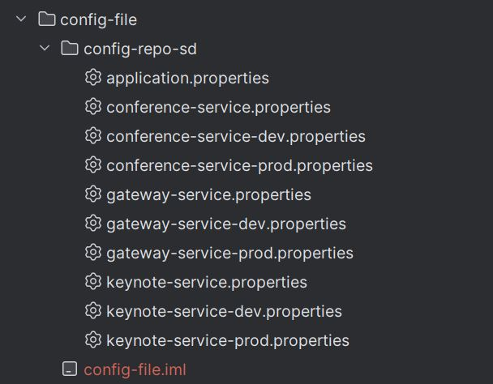
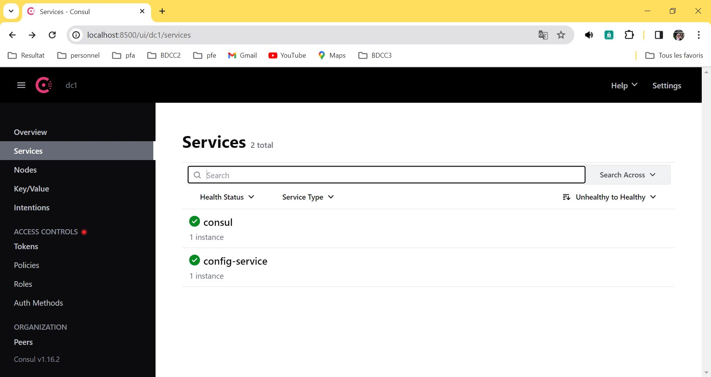
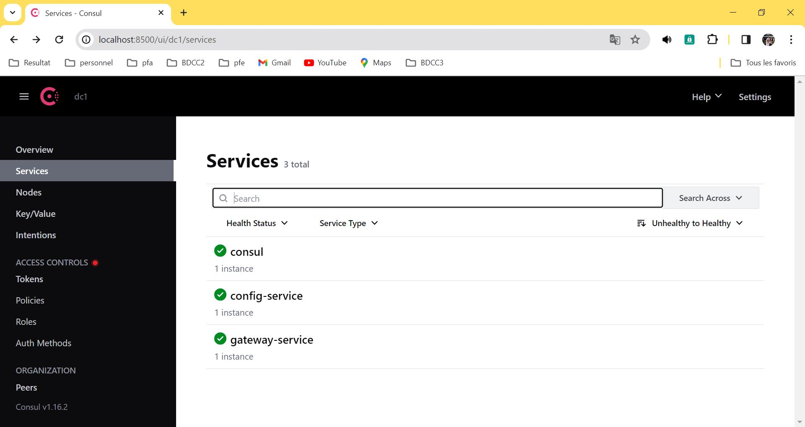
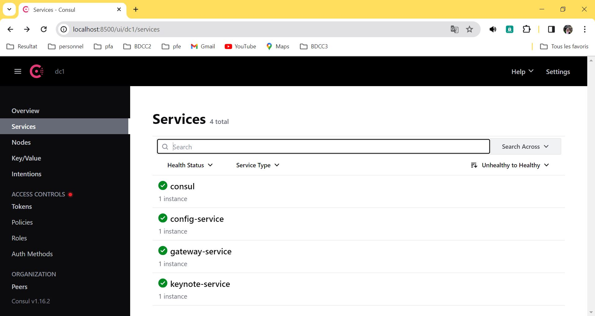
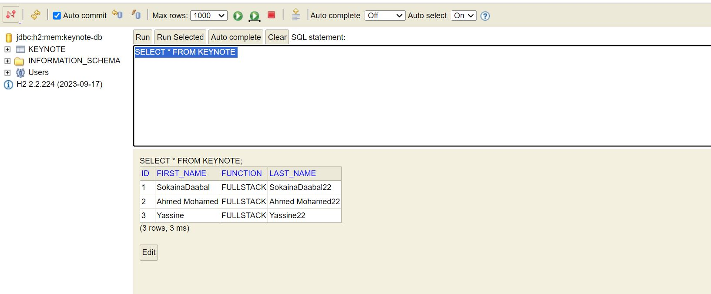
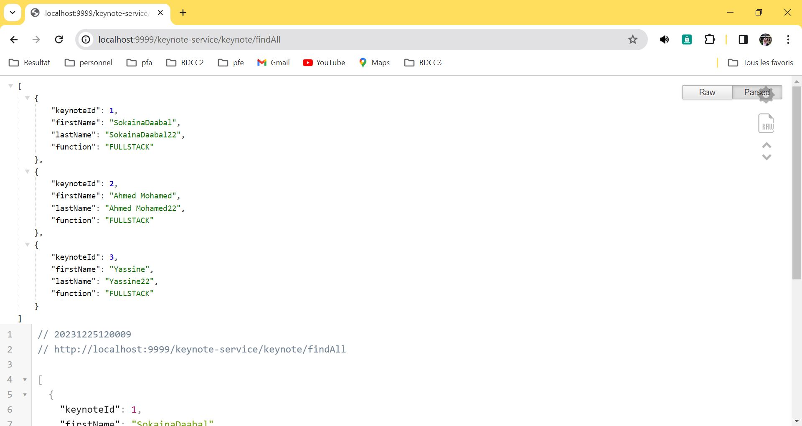

# Examen Systèmes Distribués

## Architecture technique de projet
Architecture de notre projet est concu autour d'une architecture micro-service.
Il contient deux micro-services, un config-service, gateway service et la partie front-end.
Voilà une description :
1. Micro-services fonctionnels :
   * Microservice Keynote
     * Responsable de la gestion des intervenants (Keynote). 
     * Entités : id, nom, prénom, email, fonction. 
     * Opérations : CRUD (Create, Read, Update, Delete) pour les Keynote.
   * Micro-service Conférence :
     * Responsable de la gestion des conférences. 
     * Entités : id, titre, type (académique ou commerciale), date, durée, nombre d'inscrits, score. 
     * Opérations : CRUD pour les conférences. 
     * Sous-entité : Review (id, date, texte, note).
     
2. Micro-services techniques :
    * Service Gateway (Spring Cloud Gateway) :
   Responsable de la gestion des requêtes entrantes et de l'acheminement vers les microservices appropriés. Gestion des points de terminaison, routage.
    * Service Discovery (Consul Discovery) :
    Gestion du registre des microservices pour permettre la découverte dynamique. 
   Les microservices s'enregistrent ici et peuvent découvrir d'autres services.
    * Service de Configuration (Consul Config) : 
   Gestion centralisée de la configuration pour tous les microservices. les configurations, telles que les propriétés d'application, sont stockées ici.



## Creation des micro-services
### Dependencies
Pour les deux micro-services :
* Spring Data Jpa 
* Spring web 
* Lombok 
* h2 database 
* Rest Repository 
* Consul client 
* config client 
* spring boot actuator

Pour la configuration consul :
* Config service 
* Spring boot actuator 
* consul discovery 

Pour la gateway :
* Gateway 
* Spring boot actuator 
* Consul Discovery

A ce stade toute les micro-services sont cree.

## test de gateway-service et config-service
### Demarage de service
D'abord en commence par exectuer consul.

```shell
consul agent -server -bootstrap-expect=1 -data-dir=consul-data -ui -bind=192.168.48.141
```
Pour consulter consul, utiliser l'URL suivant : http://localhost:8500/ui/dc1/services



### Configuration Service
#### Activer la configuration
Pour activer la configuration, nous avons besoin de deux choses :
* annotation : @EnableConfigServer et @EnableDiscoveryClient dans la class main de config-service
* application.properties :
```properties
server.port=8888
spring.application.name=config-service
```
Et nous avons besoin de créer un dossier config-file/config-repo dans lequel nous mettons la configuration de nos micro-services. Ce dossier contient un fichier application.properties, ce fichier contient la configuration globale pour tous les micro-services.
Dans le meme dossiers, nous avons la possibility de créer des configurations adoptées pour un micro-service dans un environments soit de test, dev ou prod.



Dans chaque fichier en fait une configuration specifique.

On access a config-repo en terminal puis en lance les commandes suivant :

```shell
git init
git add .
git commit -m "v1"
```
Revenir a le fichier application.properties dans le dossier config-service et ajouter l'url de dossier config-repo

```properties
spring.cloud.config.server.git.uri=file:///C:/Users/Daabal Sokaina/Documents/GitHub/Traitement-parallele-en-Big-Data/Examen_SD_SokainaDaabal_BDCC3/config-file/config-repo-sd
```
En demmare la config service :



### Gateway Service
### Detecter les routes
Dans la class main, nous avons ajouter la function definitionLocator qui va detecter quel micro service doit repondre a requeret de client:

```java
  @Bean
// À chaque fois que tu reçois une request regrade dans l'URL, tu vas trouver le nom de micro service, il prend ce dernier et router la request vers le bon micro-service.
    DiscoveryClientRouteDefinitionLocator definitionLocator(ReactiveDiscoveryClient rdc, DiscoveryLocatorProperties properties){
            return new DiscoveryClientRouteDefinitionLocator(rdc,properties);
            }
```
Pour continu la configuration, nous avons ajouter quelques elements dans le fichier applications.properties:
```properties
server.port=9999
spring.application.name=geteway-service

spring.config.import=optional:configserver:http://localhost:8888
```
Une fois la class main lance, la gateway enregistre dans consul :

## le micro-service Keynote-service

### configuration de micro-service
Pour que ce micro service eu la capacite de chercher leur configuration, nous avons beoisn d'ajouter une configuration dans le fichier application.properties pour voire au ce trouve config server :

```properties
server.port=9999
spring.application.name=gateway-service
spring.config.import=optional:configserver:http://localhost:8888
```
on demarre le micro service, le service sera afficher dans le consul



Apres cette configuration, nous avons creer  :
* Entities
```java
@Entity
@Data
@AllArgsConstructor
@NoArgsConstructor
public class Keynote {
    @Id
    @GeneratedValue(strategy = GenerationType.IDENTITY)
    private Long id;
    private String firstName;
    private String lastName;
    private String function;
}
```
* Repositories
```java
@RepositoryRestResource
public interface KeynoteRepository extends JpaRepository<Keynote,Long> {
}
```
* DTO
```java
@Data
public class KeynoteDTO {
    private Long keynoteId;
    private String firstName;
    private String lastName;
    private String function;
}
```
* Mappers
```java
@Service
public class keynoteMapperImpl {
    public KeynoteDTO fromKeynote(Keynote keynote){
        KeynoteDTO keynoteDTO = new KeynoteDTO();
        keynoteDTO.setKeynoteId(keynote.getId());
        BeanUtils.copyProperties(keynote,keynoteDTO);
        return  keynoteDTO;
    }
    public Keynote fromKeynoteDTO(KeynoteDTO keynoteDto){
        Keynote keynote = new Keynote();
        BeanUtils.copyProperties(keynoteDto,keynote);
        return  keynote;
    }
}
```
* Services
  * KeynoteService
```java
public interface KeynoteService {

    // creation Keynote
    KeynoteDTO saveKeynote(KeynoteDTO keynoteDTO);
    // recherché à partir son nom ou fonction
    List<KeynoteDTO> searchKeynote(String keyword);
    // recuperer la liste des keynote
    List<KeynoteDTO> getAllKeynoteDto();
    // recuperer keynote a partir de ID
      KeynoteDTO getKeynote(Long keynoteId) throws keynoteNotExiste;
    // modifier un keynote
      KeynoteDTO updateKeynote(KeynoteDTO keynoteDTO) throws keynoteNotExiste  ;
    // delete keynote
      void deleteKeyNote(Long keynoteId);

}
```
  * KeynoteServiceImpl
```java
@Service
@Transactional
@AllArgsConstructor
@Slf4j  // system de journalisation  pour logger vos message
public class KeynoteServiceImpl implements KeynoteService{

    private KeynoteRepository keynoteRepository;
    private keynoteMapperImpl keynoteMapperImppl;
    @Override
    public KeynoteDTO saveKeynote(KeynoteDTO keynoteDTO) {
        log.info("Saving new Keynote");
        Keynote keynote = keynoteMapperImppl.fromKeynoteDTO(keynoteDTO);
        Keynote saveKeynote= keynoteRepository.save(keynote);
        return keynoteMapperImppl.fromKeynote(saveKeynote);
    }

    @Override
    public List<KeynoteDTO> searchKeynote(String keyword) {
        return null;
    }

    @Override
    public List<KeynoteDTO> getAllKeynoteDto() {
        List<Keynote> keynotes= keynoteRepository.findAll();
        return keynotes.stream().map(customer -> keynoteMapperImppl.fromKeynote(customer)).collect(Collectors.toList());
    }

    @Override
    public KeynoteDTO getKeynote(Long keynoteId) throws keynoteNotExiste {
        return null;
    }

    @Override
    public KeynoteDTO updateKeynote(KeynoteDTO keynoteDTO) throws keynoteNotExiste {
        return null;
    }

    @Override
    public void deleteKeyNote(Long keynoteId) {

    }
}

```
* RestControllers
```java
@RestController
@RequestMapping("/keynote")
@AllArgsConstructor
@CrossOrigin(value = "*",maxAge = 3600)
@Slf4j // les logs
public class KeynoteRestController {

    private KeynoteService keynoteService;

    @GetMapping("/findAll")
    public List<KeynoteDTO> keynoteDTOS(){
        return keynoteService.getAllKeynoteDto();
    }
    @PostMapping("/add")
    public KeynoteDTO saveKeynote(@RequestBody KeynoteDTO keynoteDTO){
        return keynoteService.saveKeynote(keynoteDTO);
    }
}
```
* Exception
```java
public class keynoteNotExiste extends Exception{
    public keynoteNotExiste(String message) {
        super(message);
    }
}
```

### Test 
Pour tester si le micro-service se fonctionne bien. Dans le main on va ajouter quelque enregistrements:

```java
@SpringBootApplication
public class KeynoteServiceSdApplication {
	public static void main(String[] args) {
		SpringApplication.run(KeynoteServiceSdApplication.class, args);
	}
	@Bean
	CommandLineRunner start(RepositoryRestConfiguration restConfiguration, KeynoteService keynoteService) {
		restConfiguration.exposeIdsFor(Keynote.class);
		restConfiguration.exposeIdsFor(KeynoteDTO.class);
		return args -> {
			for (String nom : Arrays.asList("SokainaDaabal", "Ahmed Mohamed", "Yassine")) {
				KeynoteDTO keynoteDTO = new KeynoteDTO();
				keynoteDTO.setFirstName(nom);
				keynoteDTO.setLastName(nom + "22");
				keynoteDTO.setFunction("FULLSTACK");
				keynoteService.saveKeynote(keynoteDTO);
			}
		};
	}
}
```
En va aller a h2-consule :



Et traverse la gateway nous avons consulter endpoint ```findAll```:

