# Activité Pratique N°4 : Sécurité des Systèmes Distribués

## Partie 1 : Keycloak
### Télécharger Keycloak 23 / Démarrer Keycloak / Créer un compte Admin
en accede au site official de keycloak `https://www.keycloak.org/downloads`, et en télécharge keycloak sous format zip.
Dans le repository tools,nous avons décompressé l'archive téléchargée et nous avons lancé le serveur keycloak avec la commande suivante : 
```shell
  bin\kc.bat start-dev
```
Nous avons accéde a l'interface graphique via le lien suivant ```localhost:8080```, puis nous avons cree un compte admin.
Pour accéder, on utilise le compte administrator via le lien suivant `http://localhost:8080/auth/admin/`.

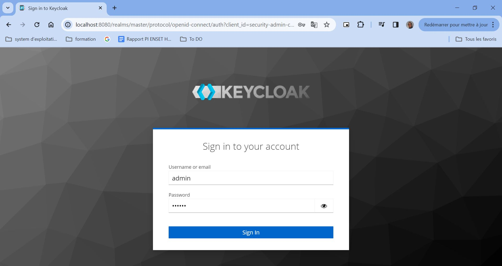

###  Créer une Realm
On cree  un nouveau realm  `wallet-realm`

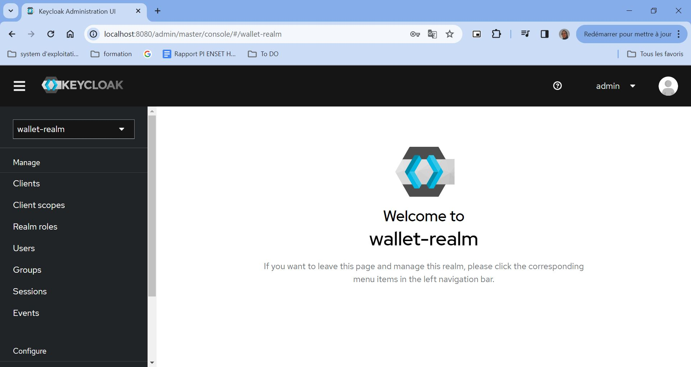

### Créer un client à sécuriser
On crée un nouveau client `wallet-client`

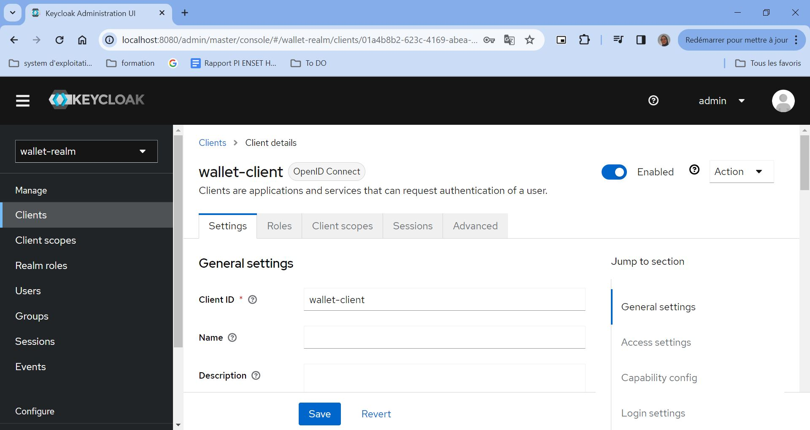

Puis, nous avons ajouté les configurations d'accès 


### Créer des utilisateurs

Nous avons cree notre premier utilisateur avec username `user1` et email `user1@gmail.com` et le password `1234`.

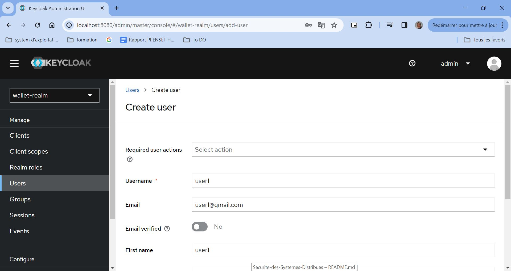

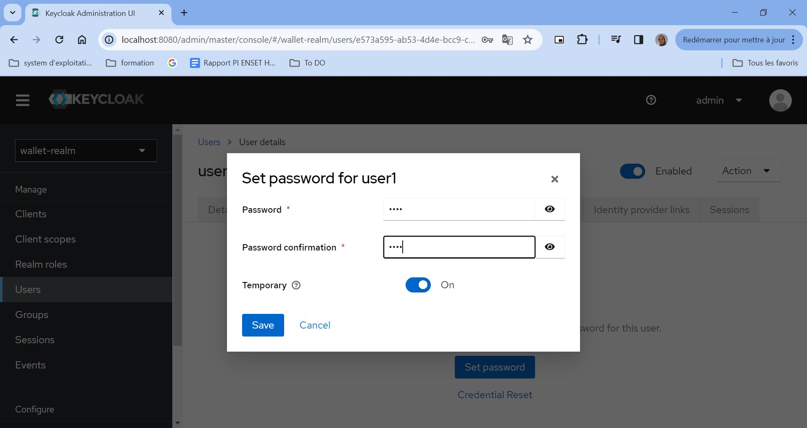

Apres, on va créer notre deuxième utilisateur. avec le nom d'utilisateur `sokainadaabal` et mot de passe `1234`.

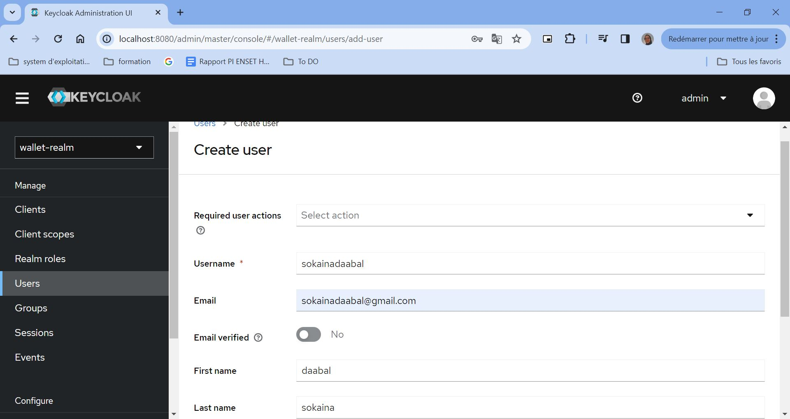

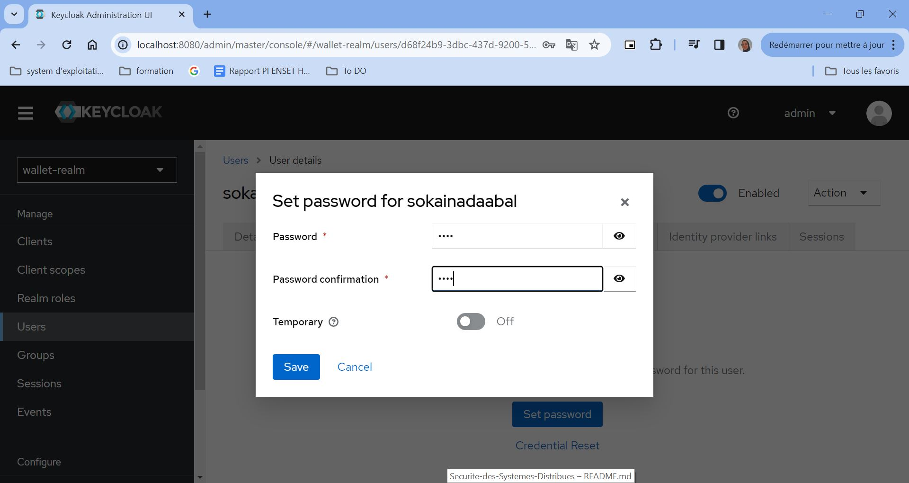

### Créer des rôles
Nous avons créé deux rôles : `USER` et `ADMIN`


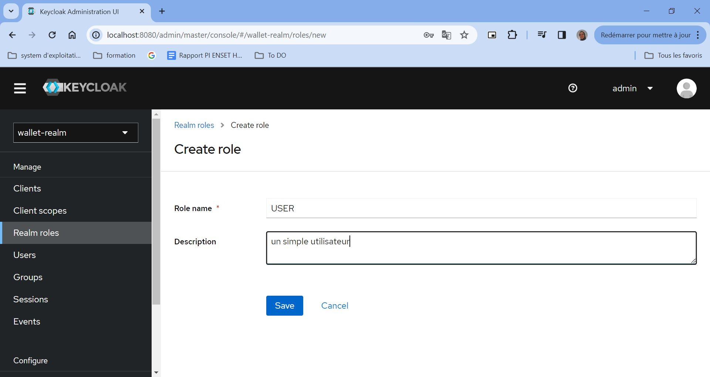

### Affecter les rôles aux utilisateurs

Nous avons affecté les rôles `ADMIN` et `USER` a les utilisateurs que nous avons déja crée

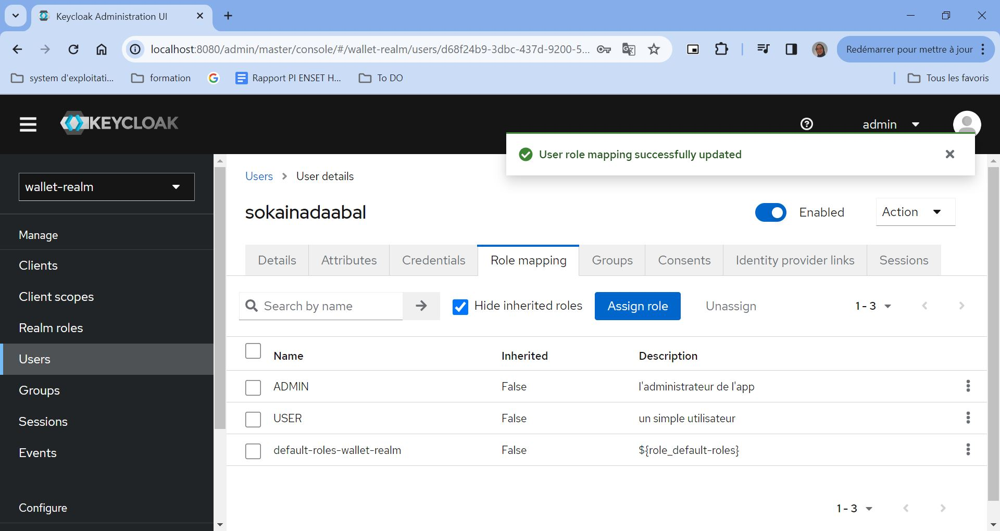

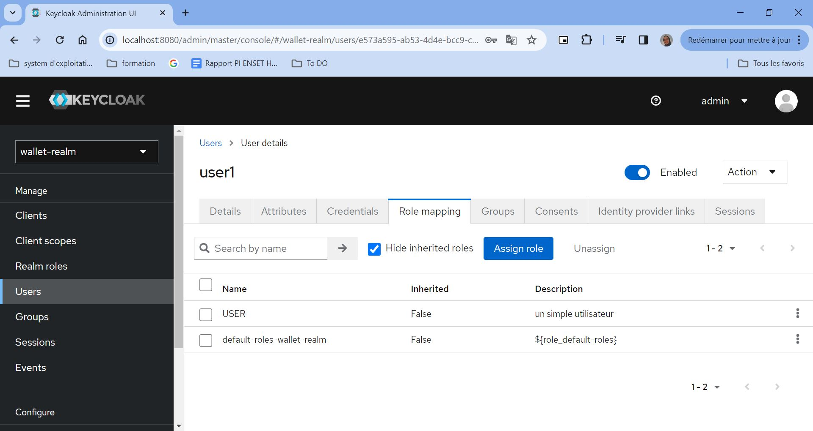

### Test avec PostMan
Tester sur postMan la réponse d'endPoint suivant : `http://localhost:8080/realms/wallet-realm/protocol/openid-connect/token`

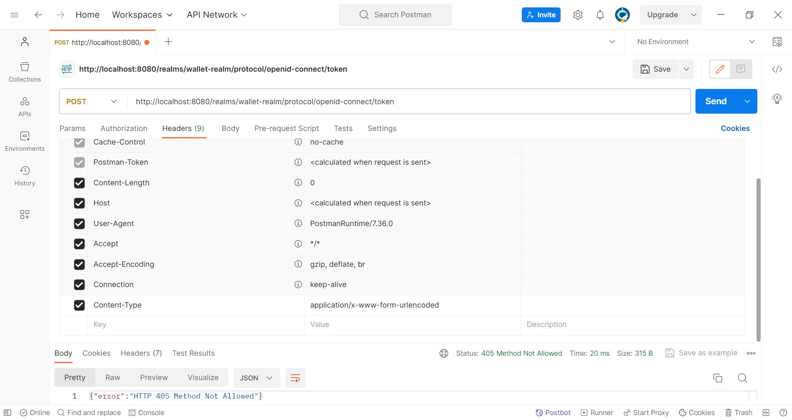

Et en ajoute les parameters suivants :

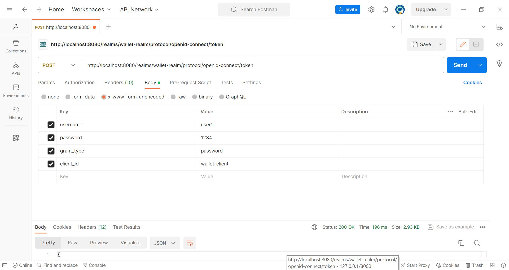

et en obtient les resultants suivantes :

```json
{
    "access_token": "eyJhbGciOiJSUzI1NiIsInR5cCIgOiAiSldUIiwia2lkIiA6ICJPSUZ4M1dNQXdNYkdXazk0dzdpNE5Ca20wTUNPT2VRekZmeGdzRjRtMS04In0.eyJleHAiOjE3MDM0NDUwMzgsImlhdCI6MTcwMzQ0NDczOCwianRpIjoiMzAzNzQwMDctMjg3MS00YmVmLTkyOGMtNWQzMWMyMDhjMWUwIiwiaXNzIjoiaHR0cDovL2xvY2FsaG9zdDo4MDgwL3JlYWxtcy93YWxsZXQtcmVhbG0iLCJhdWQiOiJhY2NvdW50Iiwic3ViIjoiZTU3M2E1OTUtYWI1My00ZDRlLWJjYzktYzJlNWUzMmUwNTA0IiwidHlwIjoiQmVhcmVyIiwiYXpwIjoid2FsbGV0LWNsaWVudCIsInNlc3Npb25fc3RhdGUiOiI3YzcwNmIyNS1lMGY1LTRmNTItYTE4Ny0zMTZkMzMwMTI3NDAiLCJhY3IiOiIxIiwiYWxsb3dlZC1vcmlnaW5zIjpbIi8qIl0sInJlYWxtX2FjY2VzcyI6eyJyb2xlcyI6WyJvZmZsaW5lX2FjY2VzcyIsInVtYV9hdXRob3JpemF0aW9uIiwiZGVmYXVsdC1yb2xlcy13YWxsZXQtcmVhbG0iLCJVU0VSIl19LCJyZXNvdXJjZV9hY2Nlc3MiOnsiYWNjb3VudCI6eyJyb2xlcyI6WyJtYW5hZ2UtYWNjb3VudCIsIm1hbmFnZS1hY2NvdW50LWxpbmtzIiwidmlldy1wcm9maWxlIl19fSwic2NvcGUiOiJwcm9maWxlIGVtYWlsIiwic2lkIjoiN2M3MDZiMjUtZTBmNS00ZjUyLWExODctMzE2ZDMzMDEyNzQwIiwiZW1haWxfdmVyaWZpZWQiOmZhbHNlLCJuYW1lIjoidXNlcjEgc29rYWluYSIsInByZWZlcnJlZF91c2VybmFtZSI6InVzZXIxIiwiZ2l2ZW5fbmFtZSI6InVzZXIxIiwiZmFtaWx5X25hbWUiOiJzb2thaW5hIiwiZW1haWwiOiJ1c2VyMUBnbWFpbC5jb20ifQ.r_FAbqKwVlozz84ZSkDJ6xEDk5WfurWo5C8byYS_9xhvWa1TEHMztMK-CZkUVDIWEkv8dCYh9ZOChX4cWapoHhgDU6YwtWyjMs-MFEuivts9LKfzirdCwrnMTEmy2Q1atSwea-L8YmHIm0ZJEjTferw1vPe8S9IDYn1mjto6B4wDu829h-oB3I9zUmsgC2AZJYDLR4sIECB7uTux9P4aiDPtKQft2eflXGngTrG2nYPhobJ4mngmxjoeDHW9GzHHOPFxuffvLVXs4mBFk7zUBgBskT_NMZijgpvEJCthRp2czSDWwzGgUSJgFZl95VU_LfIEdGg5gQcCPJK8BnqyuA",
    "expires_in": 300,
    "refresh_expires_in": 1800,
    "refresh_token": "eyJhbGciOiJIUzI1NiIsInR5cCIgOiAiSldUIiwia2lkIiA6ICIyZTIyZjExMS1hMWQ3LTRmNmItODgzNi02ZDgxYzBjOGZmYWEifQ.eyJleHAiOjE3MDM0NDY1MzgsImlhdCI6MTcwMzQ0NDczOCwianRpIjoiNzlhNGVhNjMtNjIyNS00OTdhLThhYjgtODY4ZGRkMWFkMDViIiwiaXNzIjoiaHR0cDovL2xvY2FsaG9zdDo4MDgwL3JlYWxtcy93YWxsZXQtcmVhbG0iLCJhdWQiOiJodHRwOi8vbG9jYWxob3N0OjgwODAvcmVhbG1zL3dhbGxldC1yZWFsbSIsInN1YiI6ImU1NzNhNTk1LWFiNTMtNGQ0ZS1iY2M5LWMyZTVlMzJlMDUwNCIsInR5cCI6IlJlZnJlc2giLCJhenAiOiJ3YWxsZXQtY2xpZW50Iiwic2Vzc2lvbl9zdGF0ZSI6IjdjNzA2YjI1LWUwZjUtNGY1Mi1hMTg3LTMxNmQzMzAxMjc0MCIsInNjb3BlIjoicHJvZmlsZSBlbWFpbCIsInNpZCI6IjdjNzA2YjI1LWUwZjUtNGY1Mi1hMTg3LTMxNmQzMzAxMjc0MCJ9.AMM0r8MA4FeuwZPRJEraxOxBpVTlYgpzOr6x1bZV5ck",
    "token_type": "Bearer",
    "not-before-policy": 0,
    "session_state": "7c706b25-e0f5-4f52-a187-316d33012740",
    "scope": "profile email"
}
```

En peut analyser le jwt, ``jwt.io`` dans ce site en copie le token access et obtient les resultants suivants :

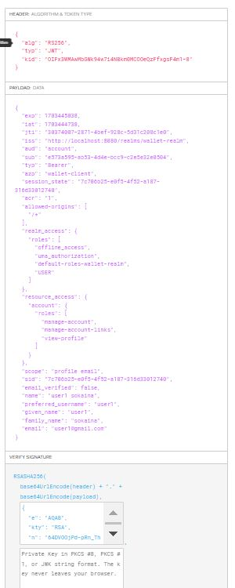

Sur keycloak en peut trouver le public key de wallet realm


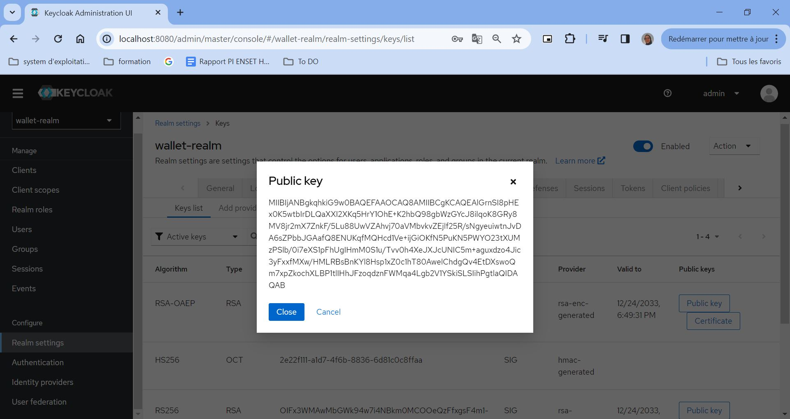

Maintenant, nous avons envoyé une nouvelle request vers endpoint en utilisant le refresh token obtenu.

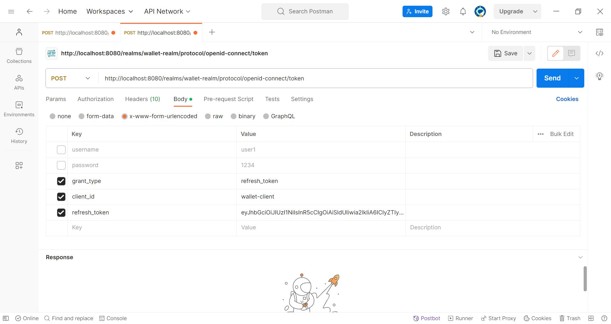

et on va obtenu un nouvel access token et refresh token

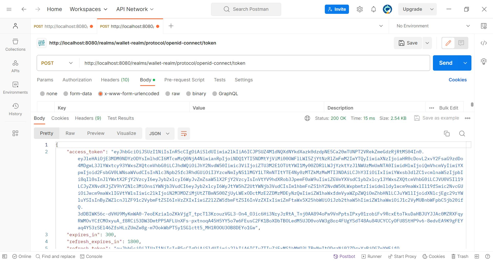

### Authentification
Active client authentication pour wallet client

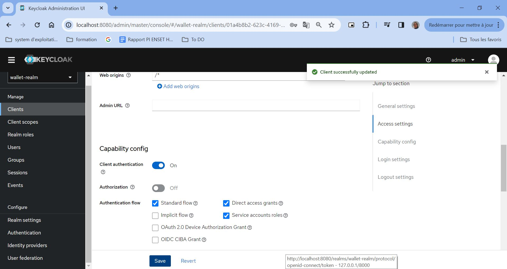

Ongle ``credentials`` s'ajoute automatiquement et un client secret ce genre aussi.

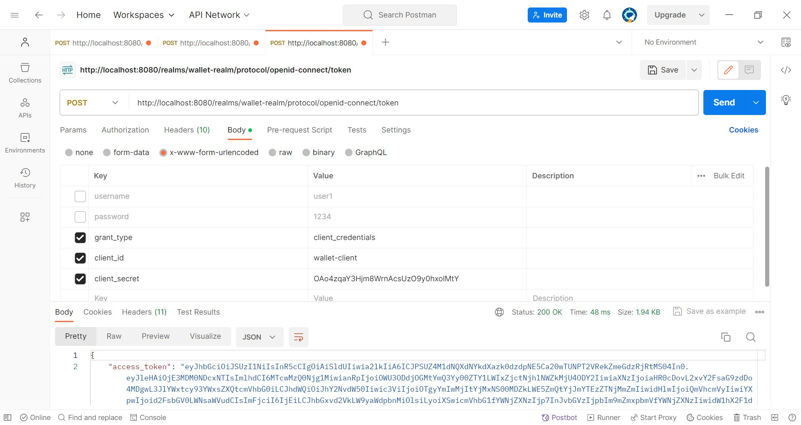

## Partie 2 : Sécuriser avec Keycloak les applications Wallet App
