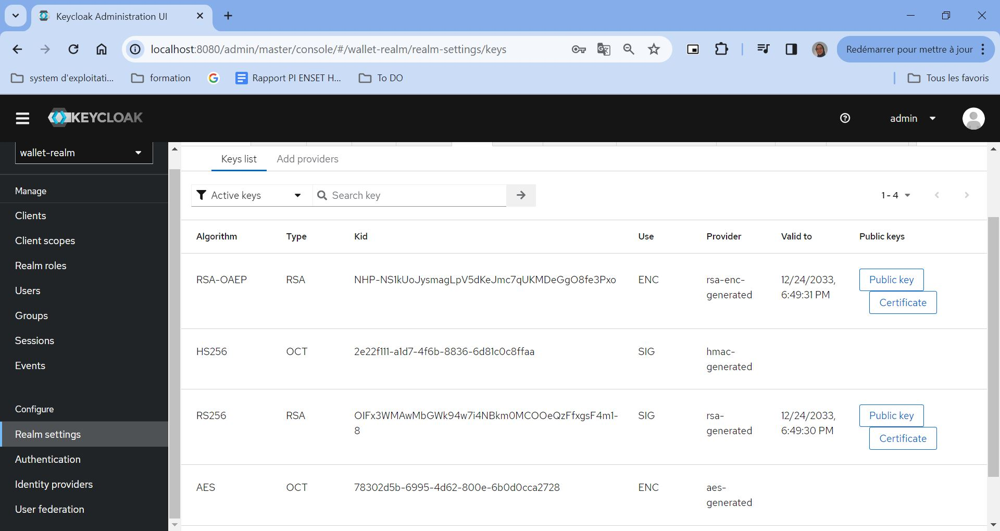
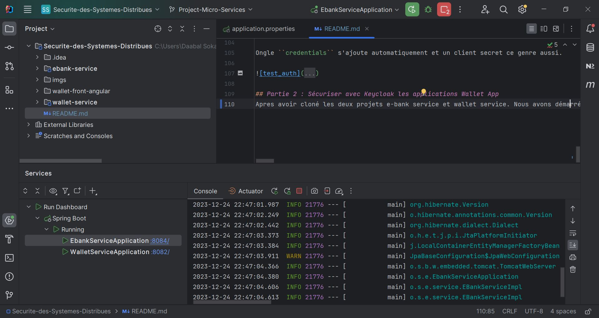
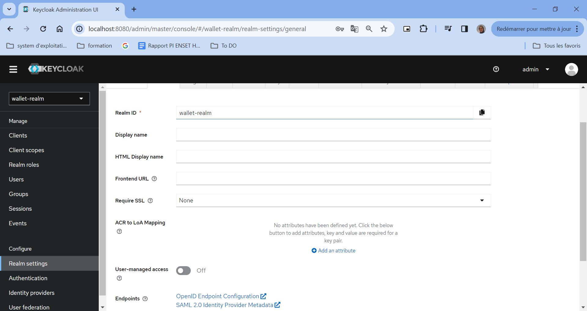
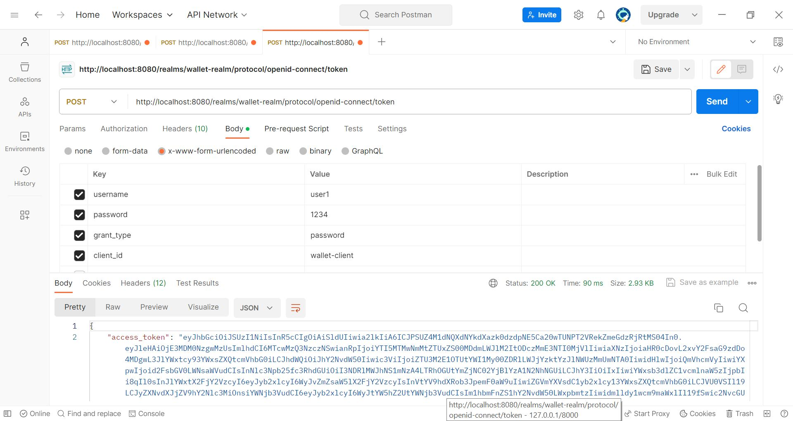
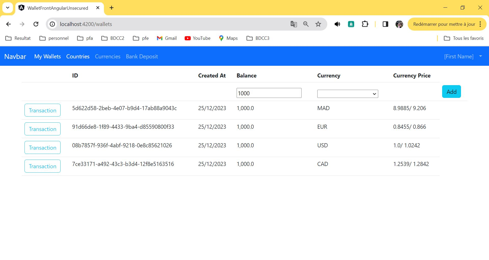
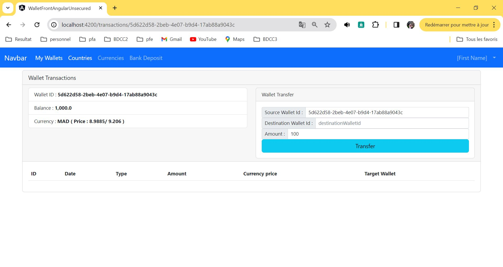
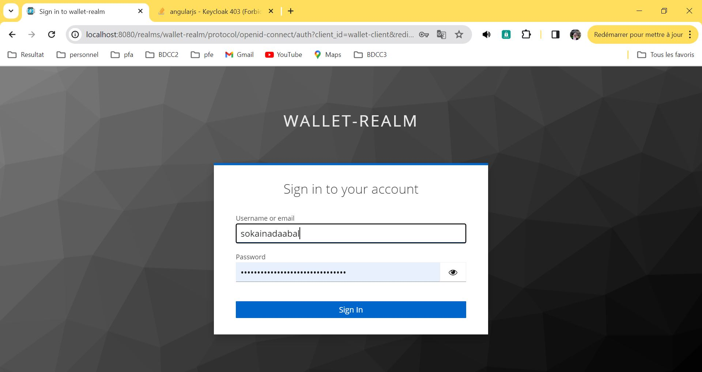

# Activité Pratique N°4 : Sécurité des Systèmes Distribués

## Partie 1 : Keycloak
### Télécharger Keycloak 23 / Démarrer Keycloak / Créer un compte Admin
en accede au site official de keycloak `https://www.keycloak.org/downloads`, et en télécharge keycloak sous format zip.
Dans le repository tools,nous avons décompressé l'archive téléchargée et nous avons lancé le serveur keycloak avec la commande suivante : 
```shell
  bin\kc.bat start-dev
```
Nous avons accéde a l'interface graphique via le lien suivant ```localhost:8080```, puis nous avons cree un compte admin.
Pour accéder, on utilise le compte administrator via le lien suivant `http://localhost:8080/auth/admin/`.


###  Créer une Realm
On cree  un nouveau realm  `wallet-realm`


### Créer un client à sécuriser
On crée un nouveau client `wallet-client`


Puis, nous avons ajouté les configurations d'accès 


### Créer des utilisateurs

Nous avons cree notre premier utilisateur avec username `user1` et email `user1@gmail.com` et le password `1234`.


Apres, on va créer notre deuxième utilisateur. avec le nom d'utilisateur `sokainadaabal` et mot de passe `1234`.


### Créer des rôles
Nous avons créé deux rôles : `USER` et `ADMIN`


### Affecter les rôles aux utilisateurs

Nous avons affecté les rôles `ADMIN` et `USER` a les utilisateurs que nous avons déja crée


### Test avec PostMan
Tester sur postMan la réponse d'endPoint suivant : `http://localhost:8080/realms/wallet-realm/protocol/openid-connect/token`


Et en ajoute les parameters suivants :


et en obtient les resultants suivantes :

```json
{
    "access_token": "eyJhbGciOiJSUzI1NiIsInR5cCIgOiAiSldUIiwia2lkIiA6ICJPSUZ4M1dNQXdNYkdXazk0dzdpNE5Ca20wTUNPT2VRekZmeGdzRjRtMS04In0.eyJleHAiOjE3MDM0NDUwMzgsImlhdCI6MTcwMzQ0NDczOCwianRpIjoiMzAzNzQwMDctMjg3MS00YmVmLTkyOGMtNWQzMWMyMDhjMWUwIiwiaXNzIjoiaHR0cDovL2xvY2FsaG9zdDo4MDgwL3JlYWxtcy93YWxsZXQtcmVhbG0iLCJhdWQiOiJhY2NvdW50Iiwic3ViIjoiZTU3M2E1OTUtYWI1My00ZDRlLWJjYzktYzJlNWUzMmUwNTA0IiwidHlwIjoiQmVhcmVyIiwiYXpwIjoid2FsbGV0LWNsaWVudCIsInNlc3Npb25fc3RhdGUiOiI3YzcwNmIyNS1lMGY1LTRmNTItYTE4Ny0zMTZkMzMwMTI3NDAiLCJhY3IiOiIxIiwiYWxsb3dlZC1vcmlnaW5zIjpbIi8qIl0sInJlYWxtX2FjY2VzcyI6eyJyb2xlcyI6WyJvZmZsaW5lX2FjY2VzcyIsInVtYV9hdXRob3JpemF0aW9uIiwiZGVmYXVsdC1yb2xlcy13YWxsZXQtcmVhbG0iLCJVU0VSIl19LCJyZXNvdXJjZV9hY2Nlc3MiOnsiYWNjb3VudCI6eyJyb2xlcyI6WyJtYW5hZ2UtYWNjb3VudCIsIm1hbmFnZS1hY2NvdW50LWxpbmtzIiwidmlldy1wcm9maWxlIl19fSwic2NvcGUiOiJwcm9maWxlIGVtYWlsIiwic2lkIjoiN2M3MDZiMjUtZTBmNS00ZjUyLWExODctMzE2ZDMzMDEyNzQwIiwiZW1haWxfdmVyaWZpZWQiOmZhbHNlLCJuYW1lIjoidXNlcjEgc29rYWluYSIsInByZWZlcnJlZF91c2VybmFtZSI6InVzZXIxIiwiZ2l2ZW5fbmFtZSI6InVzZXIxIiwiZmFtaWx5X25hbWUiOiJzb2thaW5hIiwiZW1haWwiOiJ1c2VyMUBnbWFpbC5jb20ifQ.r_FAbqKwVlozz84ZSkDJ6xEDk5WfurWo5C8byYS_9xhvWa1TEHMztMK-CZkUVDIWEkv8dCYh9ZOChX4cWapoHhgDU6YwtWyjMs-MFEuivts9LKfzirdCwrnMTEmy2Q1atSwea-L8YmHIm0ZJEjTferw1vPe8S9IDYn1mjto6B4wDu829h-oB3I9zUmsgC2AZJYDLR4sIECB7uTux9P4aiDPtKQft2eflXGngTrG2nYPhobJ4mngmxjoeDHW9GzHHOPFxuffvLVXs4mBFk7zUBgBskT_NMZijgpvEJCthRp2czSDWwzGgUSJgFZl95VU_LfIEdGg5gQcCPJK8BnqyuA",
    "expires_in": 300,
    "refresh_expires_in": 1800,
    "refresh_token": "eyJhbGciOiJIUzI1NiIsInR5cCIgOiAiSldUIiwia2lkIiA6ICIyZTIyZjExMS1hMWQ3LTRmNmItODgzNi02ZDgxYzBjOGZmYWEifQ.eyJleHAiOjE3MDM0NDY1MzgsImlhdCI6MTcwMzQ0NDczOCwianRpIjoiNzlhNGVhNjMtNjIyNS00OTdhLThhYjgtODY4ZGRkMWFkMDViIiwiaXNzIjoiaHR0cDovL2xvY2FsaG9zdDo4MDgwL3JlYWxtcy93YWxsZXQtcmVhbG0iLCJhdWQiOiJodHRwOi8vbG9jYWxob3N0OjgwODAvcmVhbG1zL3dhbGxldC1yZWFsbSIsInN1YiI6ImU1NzNhNTk1LWFiNTMtNGQ0ZS1iY2M5LWMyZTVlMzJlMDUwNCIsInR5cCI6IlJlZnJlc2giLCJhenAiOiJ3YWxsZXQtY2xpZW50Iiwic2Vzc2lvbl9zdGF0ZSI6IjdjNzA2YjI1LWUwZjUtNGY1Mi1hMTg3LTMxNmQzMzAxMjc0MCIsInNjb3BlIjoicHJvZmlsZSBlbWFpbCIsInNpZCI6IjdjNzA2YjI1LWUwZjUtNGY1Mi1hMTg3LTMxNmQzMzAxMjc0MCJ9.AMM0r8MA4FeuwZPRJEraxOxBpVTlYgpzOr6x1bZV5ck",
    "token_type": "Bearer",
    "not-before-policy": 0,
    "session_state": "7c706b25-e0f5-4f52-a187-316d33012740",
    "scope": "profile email"
}
```

En peut analyser le jwt, ``jwt.io`` dans ce site en copie le token access et obtient les resultants suivants :


Sur keycloak en peut trouver le public key de wallet realm




Maintenant, nous avons envoyé une nouvelle request vers endpoint en utilisant le refresh token obtenu.


et on va obtenu un nouvel access token et refresh token


### Authentification
Active client authentication pour wallet client


Ongle ``credentials`` s'ajoute automatiquement et un client secret ce genre aussi.


## Partie 2 : Sécuriser avec Keycloak les applications Wallet App
Apres avoir cloné les deux projets e-bank service et wallet service. Nous avons démarré les deux micro-services.



Puis, on peut consulter `http://localhost:8084/currencyDeposits` si tout marche bien, on obtient les donnes sous forme json


Pour security les micro-services, nous avons besoin deux dependencies, nous avons ajouté dans e-banck :
```xml
        <dependency>
            <groupId>org.springframework.boot</groupId>
            <artifactId>spring-boot-starter-security</artifactId>
        </dependency>
        <dependency>
            <groupId>org.keycloak</groupId>
            <artifactId>keycloak-spring-boot-starter</artifactId>
            <version>22.0.1</version>
        </dependency>
```
et il faut ajouter quelque configuration dans le fichier ```application.properties```:
```properties
keycloak.realm=wallet-realm
keycloak.resource=wallet-client
keycloak.bearer-only=true
keycloak.auth-server-url=http://Localhost:8080
keycloak.ssl-required=none
```

Dans realm setting, nous modifions ssl required et on select none



Dans le service e-bank, nous avons ajouté un package security dans le quelle, nous avons ajouté deux classes.

- keycloakAdapterConfig.java
- SecurityConfig

Sur Postman, on envoie une nouvelle request pour obtenu le nouvel access token.



Qui va etre utiliser pour envoyer des requests.

Pour le côté front-end, avant de security, on trouve notre interface comme suivant :





Pour security l'application front-end, il y a quelque etape à suivre.
Installation des dependencies :
```shell
npm install keycloak-angular keycloak-js --force
```
Dans ```app.module.ts```, importer ```KeycloakAngularModule``` et ajoute la fonction suivante :

```ts
export function kcFactory(kcService : KeycloakService){
    return ()=>{
        kcService.init({
            config: {
                url: 'http://localhost:8080',
                realm: 'wallet-realm',
                clientId: 'wallet-client'
            },
            initOptions: {
                onLoad: 'login-required',
                checkLoginIframe: true
            },
        })
    }
}
...
providers: [
    {provide : APP_INITIALIZER, deps : [KeycloakService],useFactory : kcFactory, multi : true}
],
```

dans ```security.guard.ts``` nous avons ajouté la configuration suivante :

```ts
import { Injectable } from '@angular/core';
import {
  ActivatedRouteSnapshot,
  Router,
  RouterStateSnapshot
} from '@angular/router';
import { KeycloakAuthGuard, KeycloakService } from 'keycloak-angular';

@Injectable({
  providedIn: 'root'
})
export class AuthGuard extends KeycloakAuthGuard {
  constructor(
    protected override readonly router: Router,
    protected readonly keycloak: KeycloakService
  ) {
    super(router, keycloak);
  }

  public async isAccessAllowed(
    route: ActivatedRouteSnapshot,
    state: RouterStateSnapshot
  ) {
    // Force the user to log in if currently unauthenticated.
    if (!this.authenticated) {
      await this.keycloak.login({
        redirectUri: window.location.origin
      });
    }

    // Get the roles required from the route.
    const requiredRoles = route.data['roles'];

    // Allow the user to proceed if no additional roles are required to access the route.
    if (!Array.isArray(requiredRoles) || requiredRoles.length === 0) {
      return true;
    }

    // Allow the user to proceed if all the required roles are present.
    return requiredRoles.every((role) => this.roles.includes(role));
  }
}
```

Dans ```security.service.ts```, nous avons ajouter le code suivant :
```ts
import {Injectable} from "@angular/core";
import {KeycloakProfile} from "keycloak-js";
import {KeycloakEventType, KeycloakService} from "keycloak-angular";

@Injectable({providedIn : "root"})
export class SecurityService {

  public profile? : KeycloakProfile;
  constructor (public kcService: KeycloakService) {

    this.init();

  }

  init(){

    this.kcService.keycloakEvents$.subscribe({

      next: (e) => {

        if (e.type == KeycloakEventType.OnAuthSuccess) {
          this.kcService.loadUserProfile().then(profile=>{
            this.profile=profile;

          });

        }

      }

    });

  }

  public hasRoleln(roles:string[]):boolean{
    let userRoles = this.kcService.getUserRoles();

    for(let role of roles){

      if (userRoles.includes(role)) return true;
    } return false;

  }

}
```
dans ```navbar.component.html``` nous avons ajouter le firstname de l'utilisateur authentifié.
```html
<a class="nav-link" *ngIf="securityService.profile; else loginTemplate">
    <a>{{securityService.profile.firstName}}</a>
</a>
```

Et dans ```navbar.component.ts```, nous avons ajouté la configuration suivante :

```ts
constructor(public securityService:SecurityService) { }
...
onLogout() {
    this.securityService.kcService.logout(window.location.origin);
}
...
async login(){
    await this.securityService.kcService.login({
        redirectUri : window.location.origin
    })
}
```
Vers la fin, notre application besoin d'une authentification pour accede a les autres fonctions.

