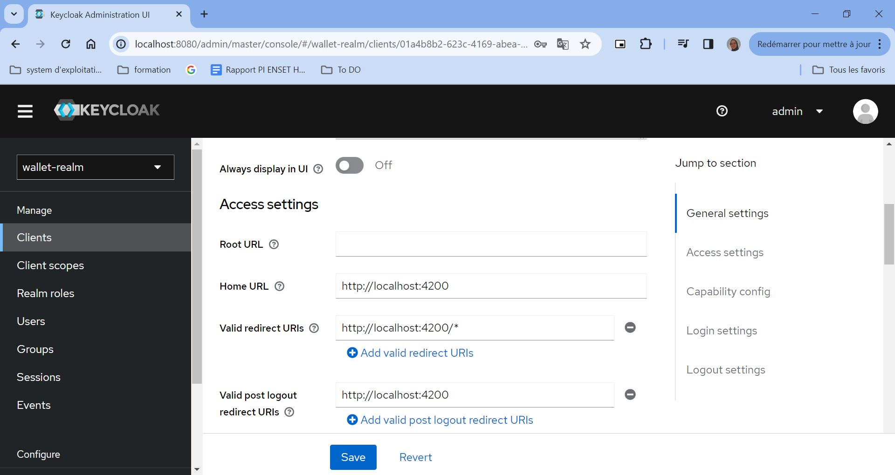

# Activité Pratique N°4 : Sécurité des Systèmes Distribués

## Partie 1 : Keycloak
### Télécharger Keycloak 23 / Démarrer Keycloak / Créer un compte Admin
en accede au site official de keycloak `https://www.keycloak.org/downloads`, et en télécharge keycloak sous format zip.
Dans le repository tools,nous avons décompressé l'archive téléchargée et nous avons lancé le serveur keycloak avec la commande suivante : 
```shell
  bin\kc.bat start-dev
```
Nous avons accéde a l'interface graphique via le lien suivant ```localhost:8080```, puis nous avons cree un compte admin.
Pour accéder, on utilise le compte administrator via le lien suivant `http://localhost:8080/auth/admin/`.


###  Créer une Realm
On cree  un nouveau realm  `wallet-realm`


### Créer un client à sécuriser
On crée un nouveau client `wallet-client`


Puis, nous avons ajouté les configurations d'accès 



### Créer des utilisateurs

Nous avons cree notre premier utilisateur avec username `user1` et email `user1@gmail.com` et le password `1234`.


Apres, on va créer notre deuxième utilisateur. avec le nom d'utilisateur `sokainadaabal` et mot de passe `1234`.


### Créer des rôles
Nous avons cree deux role `USER` et `ADMIN`


### Affecter les rôles aux utilisateurs

Nous avons affecté les roles `ADMIN` et `USER` a les utilisateurs que nous avons déja crée


### PostMan

## Partie 2 : Sécuriser avec Keycloak les applications Wallet App
